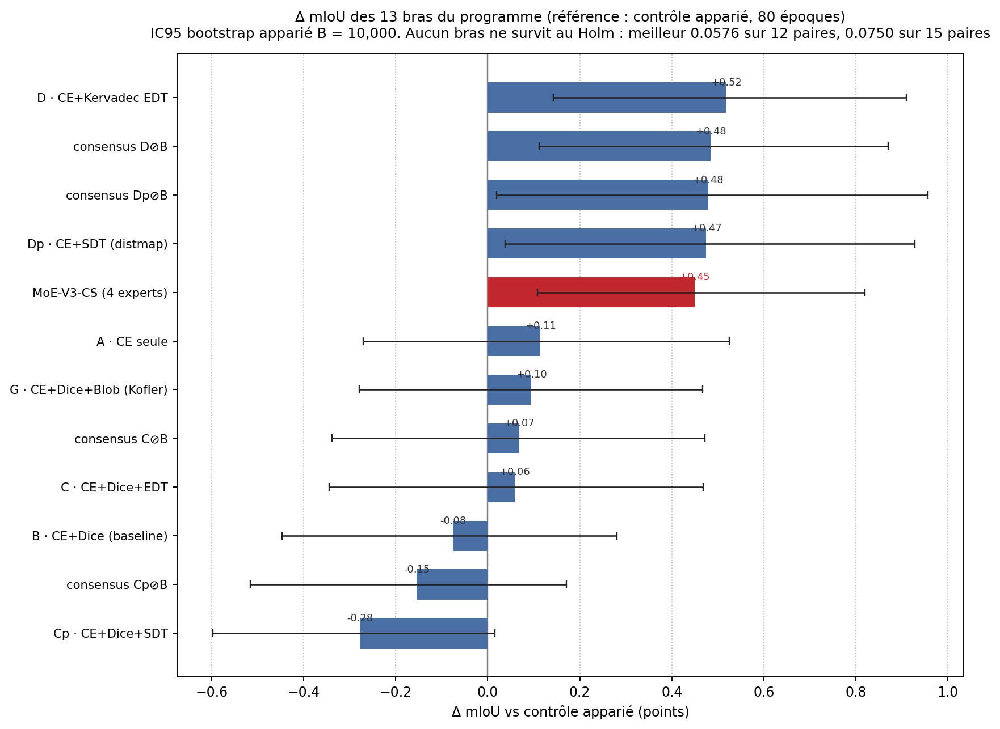
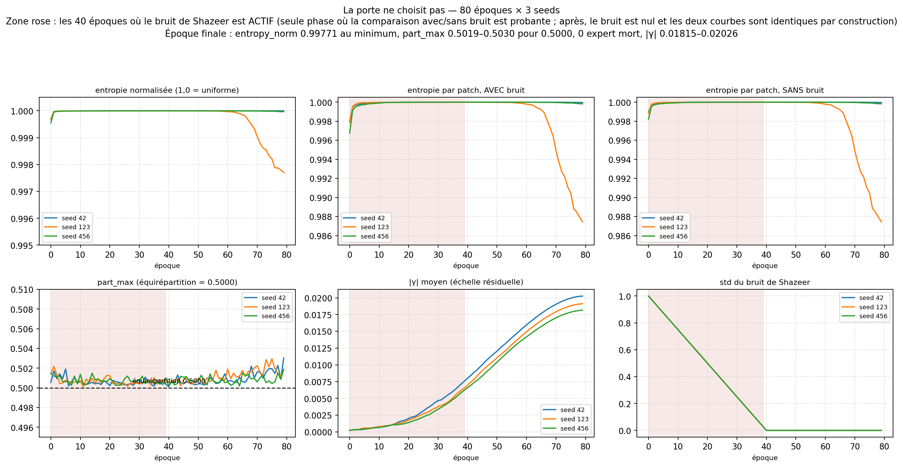
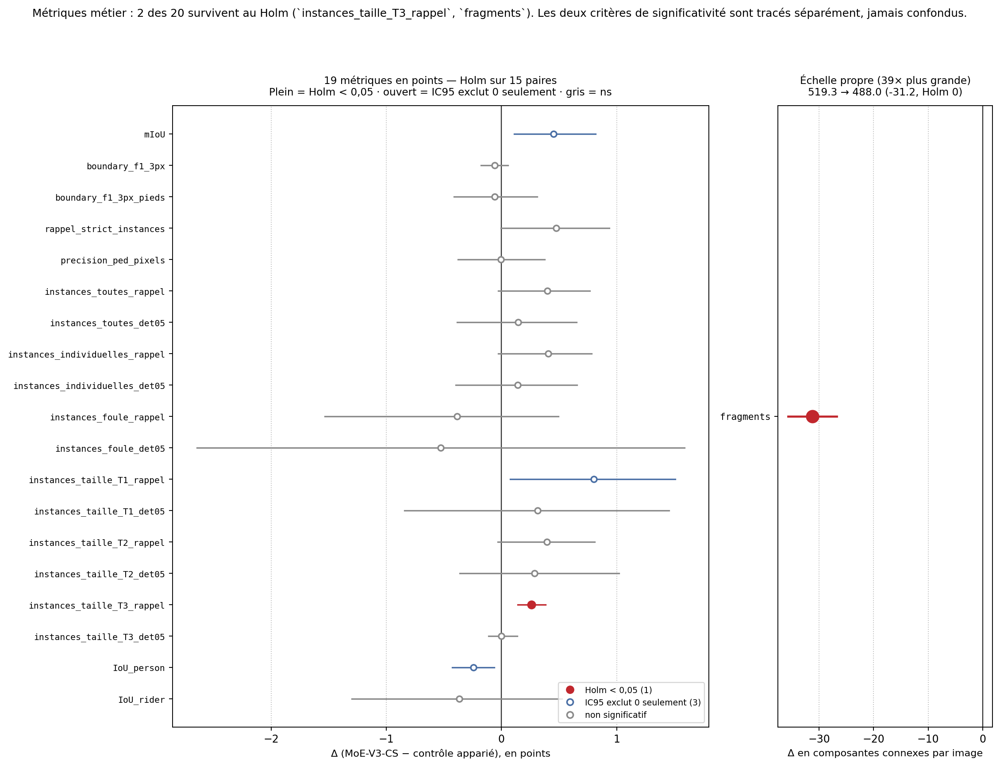
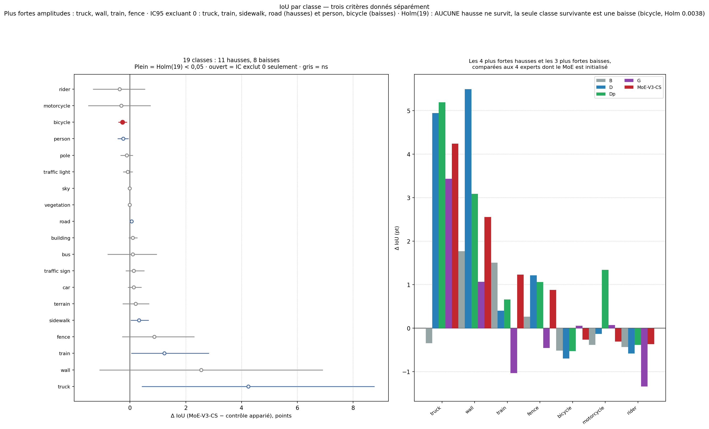
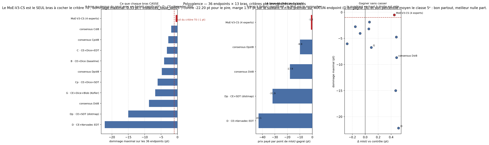

---
header-includes:
  - \usepackage{float}
  - \floatplacement{figure}{H}
  - \usepackage{booktabs}
---

# The Gate Still Does Not Choose: An Expert-Initialised Mixture-of-Experts Beats Its Matched Control and Is the Only All-Rounder Arm under Full-Resolution Cityscapes Metrics

*Cityscapes val · ConvNeXt-V2-Base + UPerNet · four experts initialised from the loss specialists B, D, Dp, G · top-2 patch-wise gate over 3×3 patches · 3 seeds × 80 epochs at 1024×2048, against a recipe-matched no-MoE control*

---

## Abstract

We report a pre-registered, controlled evaluation of **MoE-V3-CS**, a patch-wise **mixture-of-experts** inserted into a full-resolution Cityscapes segmenter (ConvNeXt-V2-Base + UPerNet, 1024×2048, 19 classes, BF16). Its four experts are **initialised bit-for-bit from the `head.fpn_convs.0` block of four independently trained loss specialists of the same seed** — B (CE+Dice), D (CE+Kervadec EDT), Dp (CE+SDT distance map), G (CE+Dice+0.5·blob) — and a top-2 gate over 3×3 patches is then trained for 80 epochs from a residual scale γ initialised to zero, so that epoch 0 is bit-exact to the control. The **pre-registered primary endpoint** is the dataset-level official mIoU (cityscapesScripts, 19 classes) on the shared 500-image val holdout, MoE-V3-CS against its **recipe-matched control** (same B initialisation, same recipe, 80 epochs, no MoE layer), paired image-bootstrap B = 10 000, three seeds averaged within each replicate.

The primary endpoint is **positive at the raw threshold and inside the pre-registered single-pair family**: Δ = **+0.449 pt** (MoE 81.618 vs control 81.168), 95 % CI [+0.109 ; +0.820], two-sided p = **0.0066**, Holm = 0.0066 over the 1-pair family. It **does not survive the exploratory multiplicity families**: Holm = 0.0726 over 12 pairs and Holm = 0.0924 over 15 pairs — and **no arm of the plateau survives either** (best 0.0750). All three families are reported together, none is chosen because it flatters. The central result is a **routing diagnostic**: at the final epoch the gate distribution is flat (minimal normalised entropy 0.99771 over the three seeds, `part_max` 0.5030 / 0.5019 / 0.5019 against 0.5000 for exact equidistribution, every expert between 49.79 % and 50.30 % of the patches, **zero dead experts**), yet γ grows from 0.00024 to ≈ 0.020 (×77 to ×84) — the mixture **helps**, but as an **average of experts**, not as a selection. The gain does not come from routing; it comes from the expert initialisation. This **replicates on a second dataset, a second architecture and a second attach point** the BRATS result *The Gate Does Not Choose* [DOI 10.5281/zenodo.22903668], of which this paper is a replication, not a republication: no BRATS number is reused.

On the program's pre-registered versatility criterion (36 endpoints × 13 arms), MoE-V3-CS is the **only all-rounder**: maximal damage **−0.53 pt** (crowd-group instances det@0.5) against −1.90 (consensus C⊘B) and −22.20 (D, pedestrian pixel precision 70.0 → 47.8), a margin of 1.37 pt over the next arm, and the cheapest plateau of the field at **−1.2 pt of damage per mIoU point** against −43.1 for D. It is nonetheless **first on none of the 36 endpoints** (D wins 16) and its mean percentile is 60.4 (5th of 11): *good everywhere is not best everywhere*. Two business metrics survive the 15-pair Holm — `fragments` (−31.2 connected components per image) and `instances_taille_T3_rappel` (+0.26 pt, largest-instance recall) — while no per-class IoU rise survives the 19-class Holm (the only survivor is a fall, bicycle 0.0038).

**Contributions.** (1) A pre-registered **positive primary** for an expert-initialised mixture against its recipe-matched control, reported with its **three** multiplicity families together and the explicit statement that it does not survive the exploratory one. (2) A **routing diagnostic that separates a tautology from a proof**: the equality `entropy_token == entropy_token_clean` at the final epoch holds *by construction* (the Shazeer noise is annealed to zero) and proves nothing; the probative comparison runs over the 40 active-noise epochs, where the clean distribution is already flat (≥ 0.99821) and `part_max` stays within [0.50011 ; 0.50217] of the 0.5000 equidistribution. (3) The correct naming of two routinely conflated routing quantities — `sum(frac) == top_k` (= 2), not 1, and `top_expert_share` (mean of per-batch maxima, 0.667 at epoch 0) ≠ `part_max` (maximum of per-batch means, 0.501). (4) A **versatility verdict recomputed from raw deltas and ranks**, with every rank carrying the denominator of its own endpoint (the MoE's worst rank is 11/12 on `instances_foule_rappel`, because arm A is in partial coverage and the denominator is therefore not constant). (5) A measured **architectural difference with BRATS**: the residual guard γ is indispensable here (without it the raw recipe costs −28.1 mIoU points at epoch 0) and absent there. (6) Public release of code, configs, tables, figures and regeneration scripts.

---

## 1. Introduction

A semantic segmenter trained with a single loss is a generalist: it is decent everywhere and excellent nowhere. A natural idea is to build several **specialists** — each trained with a different loss that favours a different behaviour (region overlap, boundary precision, distance regression, per-instance balance) — and then to **combine** them. Two combination routes exist in this program. The first is **training-free consensus**: run the specialists and merge their predictions with a connected-component veto (the C⊘B / D⊘B arms). The second, studied here, is an **internal mixture-of-experts**: insert a patch-wise gate over experts *initialised from the specialists themselves*, and train the gate (and a residual scale) for a short budget while the experts start from real, differentiated weights.

The BRATS track of this program already ran the second route and published a counter-intuitive result, *The Gate Does Not Choose* [DOI 10.5281/zenodo.22903668; concept 10.5281/zenodo.22776410]: the mixture beat its baseline, but the gate distribution stayed **flat** — the win came from *averaging* well-initialised experts, not from the gate *selecting* the right one per patch. This paper asks whether that finding is a property of the BRATS architecture (MedNeXt, 3D, GroupNorm, region-based sigmoid) or a property of the **method**:

> On a different dataset, a different architecture, a different probability regime and a different attach point, does an expert-initialised patch-wise mixture still beat its matched control — and does its gate still not choose?

The setting is a controlled arm of a four-paper loss program on Cityscapes at 1024×2048 with ConvNeXt-V2-Base + UPerNet: a distance-map auxiliary regression study [Cassez 2026a, DOI 10.5281/zenodo.21006236], a boundary-loss ablation whose arm B (CE+Dice) supplies both the initialisation and the recipe-matched control used here [Cassez 2026b, DOI 10.5281/zenodo.21006393], a blob-loss study whose arm G serves as expert 3 [Cassez 2026c, DOI 10.5281/zenodo.23083560], and this mixture-of-experts report. The answer, measured before this manuscript was written and pre-registered in the program's artifact chain (protocol P3.10), is **yes on both counts**: the mixture beats its matched control (Δ +0.449 pt, p = 0.0066), and its gate does not choose (flat routing, zero dead experts, γ > 0). The contribution is therefore not a performance claim — after the exploratory Holm correction no arm of the plateau is significant on mIoU — but a **replication of a mechanism** (average, not selection) and a **versatility diagnostic** (the only arm that is nowhere broken).

---

## 2. Related work

**Mixture-of-experts.** The sparse gate over experts of Shazeer *et al.* [2017] and the top-k routing of Lepikhin *et al.* [2020] establish the load-balanced, noise-injected gate that this paper uses verbatim (switch balancing loss, additive Gaussian noise on the logits annealed over training). Those works scale *transformer* experts and rely on the gate to specialise them. The present setting is the opposite: four *convolutional* experts that already exist, differentiated not by routing pressure but by the **loss they were trained with**, and a short fine-tuning budget. The question is then whether the gate re-specialises them or merely averages them.

**Mixture-of-experts from initialised specialists.** The BRATS MoE-V3 [Cassez & Larnier 2026, DOI 10.5281/zenodo.22903668] trains a top-2 patch-wise gate over four experts initialised from independently trained specialist arms, and reports that the gate stays flat while the mixture wins. This paper transposes that design to Cityscapes — different dataset (2D urban driving vs 3D glioma), different backbone (ConvNeXt-V2-Base + UPerNet vs MedNeXt), different attach point (`head.fpn_bottleneck` vs `dec_block_0`), different metrics (dataset-level mIoU / boundary / instance recall vs lesion-wise Dice / HD95), different probability regime (exclusive softmax vs region-based sigmoid). It cites the BRATS paper as **anteriority** and as a qualitative comparison point; it reuses **none of its numbers**.

**Combining segmenters without training.** Ensembling and connected-component consensus are the training-free alternative. Within this program the consensus arms (C⊘B, D⊘B, Cp⊘B, Dp⊘B) merge two specialists' predictions with a CC veto that prunes spurious fragments at low mIoU cost [Cassez 2026b]; on BRATS the analogous rule is published in [DOI 10.5281/zenodo.22904810]. §6.3 compares the mixture against these consensus arms on the same 13-arm plateau: two of them (D⊘B, Dp⊘B) reach a slightly higher mIoU amplitude than the mixture, but each carries a maximal damage of −8.70 and −4.77 pt respectively, against −0.53 pt for the mixture.

**Loss specialists as experts.** The four experts of this mixture are exactly the arms studied in the companion papers: CE+Dice [Cassez 2026b], CE+Kervadec boundary/EDT [Kervadec 2019; Cassez 2026b], CE+SDT distance-map regression [Cassez 2026a], and CE+Dice+0.5·blob [Kofler 2023; Cassez 2026c]. Each is a *dominated specialist* on the versatility criterion of §6.6 — excellent on the endpoints its loss targets, broken elsewhere — which is precisely what makes their combination informative: if the mixture merely averaged them it would inherit their breaks; the measurement shows it does not.

---

## 3. Method — an expert-initialised patch-wise mixture

**Base.** ConvNeXt-V2-Base [Woo 2023] pretrained ImageNet-22K (FCMAE) then fine-tuned on ImageNet-1K, + UPerNet head [Xiao 2018], full input resolution 1024×2048 without cropping, 19 Cityscapes classes, BF16 autocast, channels_last.

**Attach point.** A `PatchMoE2D` layer is inserted as the **last element** of the Sequential `head.fpn_bottleneck` (indices preserved: 0 = conv, 1 = BN, 2 = ReLU, 3 = MoE), so the block computes `fused ← fused + experts(fused)`; the residual is carried by the MoE layer itself (`src/moe/moe_model.py:attach_patch_moe`). The control checkpoint B loads with `strict=False` and the *only* missing keys are those of the MoE layer (verified at run time, otherwise the run aborts).

**Experts.** Four experts, each initialised from the **`head.fpn_convs.0`** block of one of the four loss specialists **of the same seed**, all trained 160 epochs: expert 0 ← B (CE+Dice, which also supplies backbone+head), expert 1 ← D (CE+Kervadec), expert 2 ← Dp (CE+SDT DistMap), expert 3 ← G (CE+Dice+0.5·blob). Every copy is verified **bit-for-bit**: the maximal deviation is **0.0** across the 4 experts × 3 seeds (12 copies), and each expert is matched to the *same seed* as its run — hence a strict per-seed pairing. The block choice is locked by an audit (`src/moe/AUDIT_DIVERSITE_EXPERTS.md`): the relative Frobenius distance between experts is median **0.538** across methods (min–max 0.422–0.568, all 15 pairs ≥ 0.42) against **0.122** for a backbone block, and the specialisation drift is **not reproducible across seeds** (cosine ≈ +0.001 to +0.008, noise floor 1/√N ≈ 0.0007), which is why the pairing is per-seed. The gate is **random** at initialisation (no pre-pairing).

**Routing.** Top-**2** of 4 experts, **3×3** patch grid, convolutional gate (kernel 3, `Conv→GELU→Conv1×1` + average-pool over the grid), **switch** balancing loss at weight 0.001 (weighted auxiliary 0.0020), **Shazeer noise** std 1.0 × std(logits) **annealed over 40 epochs**, residual scale initialised to **0**. Exact equidistribution of `part_max` for top-2 of 4 experts is **0.5000** (= top_k / n_experts, computed, never hard-coded); it is the reference against which §6.2 reads the routing.

**Residual guard γ (a measured difference with BRATS).** Without a residual scale, the raw BRATS recipe costs **−28.1 mIoU points at epoch 0** on this architecture (pixel agreement 91.5 %, truck −87, rider −78, traffic light −70; measured in P3.08), because the experts initialised from `head.fpn_convs.0` receive at the attach point a distribution they have never seen (the output of `fpn_bottleneck`), with no renormalisation before the classifier — a problem absent on BRATS (identical MedNeXt blocks everywhere + GroupNorm). With **γ = 0 initial, learnable per channel**, epoch 0 is **bit-exact to the control B**, and |γ| becomes a direct diagnostic of the thesis (|γ| → 0 = the mixture is useless). Measured: |γ| ≈ 0.020 at the end of training (§6.2).

**Matched control.** `control_nomoe_Binit`: same B initialisation, same recipe, **80 epochs**, *without* the MoE layer (3 seeds). This is the reference of the primary endpoint — not B (160 epochs), not the unmatched control.

**Recipe (mixture and control).** 80 epochs, batch 2 × gradient accumulation 4 (effective 8), AdamW (lr 6×10⁻⁵, weight decay 0.01, betas (0.9, 0.999)), polynomial decay (power 1.0, 1-epoch warmup), BF16, horizontal flip p = 0.5.

**Two routing quantities, correctly named.** `frac` is the share of *patches* processed by each expert (`onehot.clamp_max(1).mean(0)`, `src/moe/patch_moe2d.py`); because each patch activates top_k experts, **`sum(frac) == top_k` (= 2.0), not 1**. `top_expert_share` is the **mean of the per-batch maxima** (the average, over batches, of the largest expert's share) whereas `part_max` is the **maximum of the per-batch means** (the largest expert's share averaged over batches); by Jensen `top_expert_share ≥ part_max` (measured 0.667 vs 0.501 at epoch 0). Neither is "the share of patches handled by the first expert"; conflating them would make a flat gate look like a choosing one.

---

## 4. Experimental setup

### 4.1 Data, holdout, metrics

Cityscapes fine annotations [Cordts 2016]: 2 975 train / 500 val images, 19 evaluation classes. All evaluations run on the program's **pre-specified shared holdout**: the first 500 val images in loader order (`first:500`) — identical for all 13 arms, fixed before any arm was trained; it is *not* a random draw. The official Cityscapes leaderboard was **not** submitted to (declared limitation, §8).

* **mIoU** — dataset-level, from a single aggregated confusion matrix, estimator validated **bit-identical to the official `cityscapesScripts`** routine (`tests/test_official_miou.py`). Per-class IoU from the same matrices.
* **Boundary F1 (3 px)** — per-class F1 of predicted vs ground-truth contours within a 3-pixel tolerance [protocol of Perazzi 2016]; also restricted to {person, rider}.
* **Pedestrian instance metrics** — from the official `*_gtFine_instanceIds.png` maps, classes {person, rider}: strict recall, detection@0.5, pedestrian pixel precision; **strata** = all / individual (instId ≥ 1000) / crowd-group (instId < 1000) instances, and **size terciles** T1 (smallest) / T2 / T3 (largest) of individual instances.
* **Fragments** — 8-connected components per image summed over the 19 class masks (`count_fragments`, `src/postprocessing/consensus.py`).

### 4.2 Pre-registered primary endpoint and statistics

The single pre-registered primary endpoint is the **dataset-level official mIoU, MoE-V3-CS vs its recipe-matched control** (`moe_v3cs` vs `controle`). Test: **paired image-bootstrap** over the 500 holdout images — positions resampled with replacement, **B = 10 000** replicates, bootstrap seed **20260618**, the three seeds (42, 123, 456) averaged *within each replicate*, 95 % percentile CI, two-sided p = 2·min(frac Δ ≤ 0, frac Δ ≥ 0). The criterion was declared before the analysis runs (protocol P3.10). The primary family is the single pre-registered pair, so Holm = p there.

**Three multiplicity families, all reported.** The same contrast belongs to three different Holm families depending on which protocol declares it: the single pre-registered pair (P3.10, size 1), the master table of arms-against-control (P3.14, size 12), and the program's exploratory family that adds the four fusion-versus-expert comparisons (P3.16, size 15). Family sizes are **computed** from the artifacts (`len(pairwise)`), and every Holm value is **recomputed** from the raw p-values then compared against the stored one (agreement < 1×10⁻¹², blocking check). This is the house discipline inherited from the paper4 erratum v1.1.0, where a hand-written family label ended up mislabelling the values it carried.

**Two significance criteria, never conflated.** *Holm-significant* (corrected p < 0.05 within the stated family) and *CI-excluding-zero* (raw 95 % CI) are reported **separately** everywhere; bold in tables marks Holm significance only. This matters here: e.g. truck +4.24 IoU excludes zero but does not survive the 19-class Holm (0.1188).

**Non-determinism, declared.** cuDNN benchmark is on (`deterministic: false`, BF16). The primary numbers come from the harness forward of the pre-registered artifact (P3.10); the business-metric regeneration (§6.4) comes from a second independent GPU forward of the *same* checkpoints. The two agree within **8.58×10⁻⁴ pt** on the primary Δ (+0.449360 vs +0.450218), of the same order as the 4.13×10⁻³ pt already documented in the program's consolidation sanity; the verdict is identical in both.

---

## 5. Results

### 5.1 Primary endpoint: positive raw, not surviving the exploratory family

Pre-registered primary, paired image-bootstrap over the 500-image holdout (artifact `results/moe_v3_cs/harness/table_controle_v3cs_P310.json`):

| Quantity | MoE-V3-CS | matched control |
|---|---|---|
| mIoU (point) | **81.618** | **81.168** |
| 95 % CI | [80.264 ; 82.709] | [79.802 ; 82.251] |
| mIoU seed 42 | 81.814 | 81.561 |
| mIoU seed 123 | 81.339 | 80.556 |
| mIoU seed 456 | 81.701 | 81.388 |

**Δ(MoE − control) = +0.449 pt · 95 % CI [+0.109 ; +0.820] · p = 0.0066 → significant at the raw threshold.**

The three multiplicity families, given together (sizes computed from the artifacts, Holm recomputed from the raw p):

| Family | Size | Holm of the primary | Source artifact |
|---|---|---|---|
| pre-registered single pair (P3.10) | 1 | **0.0066** (= p) | `harness/table_controle_v3cs_P310.json` |
| arms against control (P3.14) | 12 | 0.0726 | `p314/master_table.json` |
| program exploratory (P3.16) | 15 | 0.0924 | `metiers_experts/table_metiers_experts.json` |

Honest reading: the primary endpoint is significant at the raw threshold (p = 0.0066) and **inside the pre-registered 1-pair family** (Holm = 0.0066). It **does not survive the exploratory 15-pair family** (Holm = 0.0924 > 0.05) — and **no arm of the plateau survives it either** (best Holm 0.0750). Stated as-is: on mIoU, the conclusions of this program rest on **amplitudes and their CIs**, and the contribution of this paper is what each arm **breaks** (§6.3), not the post-Holm significance of the mIoU.

**Inter-forward robustness.** A second independent GPU forward of the same checkpoints (business-metric regeneration path, §6.4) gives Δ = +0.450218 pt against +0.449360 pt for the harness — a gap of **8.58×10⁻⁴ pt** (6.07×10⁻⁴ pt on the MoE mIoU, 2.51×10⁻⁴ pt on the control mIoU), i.e. cuDNN/BF16 non-determinism. Same verdict in both sources.

*Figure 1: Δ mIoU vs the matched control for the 13 arms of the program (paired bootstrap, B = 10 000). MoE-V3-CS is 5th by amplitude; the two families of Holm are both reported in Table T3.*

**Position among the 13 arms** (reference: matched control; artifact `results/moe_v3_cs/p314/master_table.json`). Both Holm families are given, with their size computed from the artifact:

| # | Arm | mIoU | Δ vs control | 95 % CI | p | Holm (12 pairs, P3.14) | Holm (15 pairs, P3.16) |
|---|---|---|---|---|---|---|---|
| 1 | D · CE+Kervadec EDT | 81.686 | +0.518 | [+0.142 ; +0.910] | 0.0048 | 0.0576 | 0.0750 |
| 2 | consensus D⊘B | 81.652 | +0.484 | [+0.111 ; +0.871] | 0.0082 | 0.0820 | 0.1066 |
| 3 | consensus Dp⊘B | 81.647 | +0.479 | [+0.019 ; +0.957] | 0.0396 | 0.3168 | 0.4136 |
| 4 | Dp · CE+SDT (distmap) | 81.643 | +0.475 | [+0.038 ; +0.927] | 0.0312 | 0.2808 | 0.3960 |
| 5 | **MoE-V3-CS (4 experts) ← this paper** | **81.618** | **+0.449** | **[+0.109 ; +0.820]** | **0.0066** | **0.0726** | **0.0924** |
| 6 | A · CE alone | 81.283 | +0.115 | [−0.271 ; +0.525] | 0.5722 | 1.0000 | n.a. (a) |
| 7 | G · CE+Dice+Blob (Kofler) | 81.263 | +0.095 | [−0.279 ; +0.467] | 0.6552 | 1.0000 | 1.0000 |
| 8 | consensus C⊘B | 81.236 | +0.068 | [−0.338 ; +0.472] | 0.7758 | 1.0000 | 1.0000 |
| 9 | C · CE+Dice+EDT | 81.227 | +0.059 | [−0.344 ; +0.468] | 0.8096 | 1.0000 | 1.0000 |
| 10 | B · CE+Dice (baseline) | 81.093 | −0.075 | [−0.447 ; +0.281] | 0.6748 | 1.0000 | 1.0000 |
| 11 | consensus Cp⊘B | 81.014 | −0.154 | [−0.516 ; +0.170] | 0.3498 | 1.0000 | 1.0000 |
| 12 | Cp · CE+Dice+SDT | 80.890 | −0.278 | [−0.597 ; +0.016] | 0.0628 | 0.4396 | 0.6180 |
| — | control (CE+Dice 80 ep, ref) | 81.168 | 0 (ref) | — | — | — | — |

(a) A is outside the 15-pair family (partial coverage). The MoE-V3-CS is **5th of 12** by amplitude (5th of 13 with the control, which at Δ = 0 ranks 10th). **5 arms have a raw p < 0.05; none survives Holm**, neither over 12 pairs (best 0.0576) nor over 15 (best 0.0750). This is the paper's pivot: since the mIoU amplitude does not separate the arms significantly after correction, the conclusion rests on **what each arm breaks** (§6.3), where MoE-V3-CS is first by a measured margin.

### 5.2 Routing diagnostic: the gate does not choose

Read from `routing_moe_v3cs_Binit_seed*.jsonl` (80 epochs × 3 seeds), cross-checked against the summaries' `final_epoch_stats` (identity verified to 1×10⁻¹² on 8 quantities × 3 seeds). Exact equidistribution of `part_max` for top-2 of 4 experts = **0.5000** (computed `top_k / n_experts`).

| Quantity | epoch 0 (seed 42/123/456) | final epoch (seed 42/123/456) | reference | reading |
|---|---|---|---|---|
| `entropy_norm` | 0.99970 / 0.99967 / 0.99955 | **1.00000 / 0.99771 / 0.99997** | 1.0 = uniform | near-uniform gate |
| `part_max` | 0.50056 / 0.50149 / 0.50149 | **0.5030 / 0.5019 / 0.5019** | 0.5000 = equidistribution | max gap 0.0030 |
| `frac` of the 4 experts | — | [0.4979 ; 0.5030] | 0.5000 | no favoured expert |
| dead experts (`frac` = 0) | — | **0** | 0 | no collapse |
| `top_expert_share` | 0.66700 / 0.66898 / 0.65957 | 0.59755 / 0.59546 / 0.59695 | 1.0 = single expert | mean of per-batch maxima, quasi-stable |
| `noise_std` | 1.00 / 1.00 / 1.00 | 0.00 / 0.00 / 0.00 | annealed over 40 epochs | exploration off, flatness remains |
| γ (`gamma_absmean`) | 0.00024 / 0.00023 / 0.00023 | **0.02026 / 0.01912 / 0.01815** | 0 = useless MoE | strictly positive, ×77 to ×84 |

**Reading.** At the final epoch the routing distribution is flat at a minimal normalised entropy of 99.771 %, `part_max` is 0.5030 / 0.5019 / 0.5019 against 0.5000 for exact equidistribution, the four experts receive between 49.79 % and 50.30 % of the patches, and **no expert is dead**. The gate therefore does not choose: it averages.

**This is not an artifact of the Shazeer noise — and the proof is not the one one expects.** At the final epoch the noise is annealed to 0, so `entropy_token_clean` is *identical by construction* to `entropy_token`: that particular equality proves nothing (it is a tautology). The **probative** comparison runs over the **40 epochs where the noise is active** (std 1.0 × std of logits): there the maximal gap between the two entropies is **1.45×10⁻³** (seed 42 9.54×10⁻⁴, seed 123 9.95×10⁻⁴, seed 456 1.45×10⁻³), while the **noise-free** distribution stays flat at **≥ 0.99821** normalised entropy and `part_max` stays within **[0.50011 ; 0.50217]** of the 0.5000 equidistribution. In other words, the flatness of the routing is a property of the *gate*, not of the noise injected into it.

*Figure 2: routing diagnostics over training. Top: per-expert `frac` stays pinned at 0.5000 (equidistribution) with no dead expert. Middle: the noise-free entropy stays ≥ 0.99821 during the 40 active-noise epochs. Bottom: γ grows from 0.00024 to ≈ 0.020 — the mixture helps, but as an average.*

Yet the mixture **helps**: γ, the learnable per-channel residual scale (initialised to 0.0 to make epoch 0 bit-exact to the control), reaches 0.02026 / 0.01912 / 0.01815 at the end of the run against 0.00024 / 0.00023 / 0.00023 at epoch 0 (×77 to ×84). The gain therefore comes from the **average of experts**, not from selection — the replication, on Cityscapes, of the BRATS result, with another architecture and another attach point.

**Limitation, stated as-is.** `entropy_token` of seed 123 (0.98745) is very slightly below the other two (0.99996, 0.99982): the thesis holds over the 3 seeds but is not of perfect uniformity on that one.

### 5.3 Business metrics: what the mixture captures, what it pays

Holdout `first:500`, seeds averaged within each replicate, paired bootstrap B = 10 000 (seed 20260618), Holm over the **15-pair** family. Units: points (×100), except `fragments` = connected components per image. **Bold = Holm < 0.05.** The two criteria (Holm and CI-excluding-zero) are separated, never merged.

| Metric | n | control | MoE-V3-CS | Δ(MoE−ctl) | 95 % CI | p | Holm(15) | verdict |
|---|---|---|---|---|---|---|---|---|
| `mIoU` | 500 | 81.168 | 81.618 | +0.450 | [+0.110 ; +0.818] | 0.0066 | 0.0924 | CI excludes 0, does not survive Holm |
| `boundary_f1_3px` | 500 | 76.627 | 76.567 | −0.061 | [−0.178 ; +0.055] | 0.3004 | 1 | ns |
| `rappel_strict_instances` | 441 | 76.253 | 76.728 | +0.475 | [−0.004 ; +0.935] | 0.0516 | 0.2064 | ns |
| `precision_ped_pixels` | 473 | 70.028 | 70.024 | −0.004 | [−0.377 ; +0.376] | 0.9896 | 0.9896 | ns |
| `instances_toutes_rappel` | 441 | 79.975 | 80.372 | +0.397 | [−0.028 ; +0.766] | 0.0694 | 0.2776 | ns |
| `instances_individuelles_rappel` | 440 | 80.096 | 80.504 | +0.407 | [−0.030 ; +0.783] | 0.0662 | 0.2648 | ns |
| `instances_foule_rappel` | 63 | 74.584 | 74.199 | −0.384 | [−1.536 ; +0.493] | 0.4822 | 1 | ns |
| `instances_taille_T1_rappel` | 315 | 64.994 | 65.796 | +0.802 | [+0.073 ; +1.510] | 0.0330 | 0.198 | CI excludes 0, does not survive Holm |
| `instances_taille_T3_rappel` | 335 | **93.474** | **93.733** | **+0.258** | **[+0.142 ; +0.384]** | 0.0000 | **0** | **Holm-significant** |
| `IoU_person` | 500 | 85.152 | 84.910 | −0.242 | [−0.429 ; −0.062] | 0.0080 | 0.088 | CI excludes 0, does not survive Holm |
| `IoU_rider` | 500 | 68.920 | 68.555 | −0.365 | [−1.302 ; +0.524] | 0.4298 | 1 | ns |
| `fragments` | 500 | **519.3** | **488.0** | **−31.2** | **[−35.7 ; −26.7]** | 0.0000 | **0** | **Holm-significant** |

(full 20-metric table in `tables/T5_metiers.md`). Over the 20 business metrics, **2 survive the Holm** on the 15-pair family — `instances_taille_T3_rappel` (+0.26 pt, largest-instance recall) and `fragments` (−31.2 components per image), both with p = 0 — and **5 have a CI excluding zero**. It is tempting to write that only the fragments survive; that is false, and the second survivor goes *in the direction of the thesis*: the only business gain that resists multiplicity is on the **large** instances (T3), while the gain on the **small** ones (T1 +0.80) does not resist (Holm 0.198). The mixture improves what is already well seen and reduces fragmentation; it does not repair the smallest instances.

*Figure 3: business-metric Δ(MoE − control) with 95 % CI. The two panels carry distinct units — the 19 point-valued metrics on one axis, `fragments` (Δ −31.2 components per image) on its own — because plotting them together would compress the point metrics by a factor of ≈ 39 into an unreadable band.*

**What the mixture captures from the experts, and what it does not inherit** (Δ vs control, same artifact):

| Metric | Δ MoE | Δ D | Δ Dp | Δ G | computed reading |
|---|---|---|---|---|---|
| `instances_taille_T1_rappel` | +0.802 | +2.816 | +2.016 | −4.080 | captures part of D/Dp's gain |
| `rappel_strict_instances` | +0.475 | +2.183 | +1.719 | −3.417 | captures part of D/Dp's gain |
| `precision_ped_pixels` | −0.004 | −22.195 | −15.020 | −6.763 | loss, but 0.00 ≪ −22.20 (D) |
| `instances_foule_rappel` | −0.384 | +1.511 | +1.319 | −4.612 | loss, but 0.38 ≪ −4.61 (G) |
| `traffic light` (per-class) | −0.081 | −2.602 | −2.340 | +0.470 | does not inherit the boundary/distmap loss |
| `boundary_f1_3px` | −0.061 | +0.677 | +0.545 | +0.376 | neutral |

Calculated reading: MoE-V3-CS captures part of the instance gain of D/Dp (T1 +0.80 against +2.82 and +2.02) **without** inheriting either their `traffic light` loss (−0.08 against −2.60 and −2.34) or the pedestrian recall destroyed by G (+0.47 against −3.42). Its measured counterpart: **no contour gain** (`boundary_f1_3px` −0.061, ns) — consistent with §5.2, an average of experts smooths out the contour specialities. The worst family of the mixture is `contours` (−0.06 pt on average) and it is its **only** negative family (1 of 5).

### 5.4 Per-class IoU: three criteria, given separately

19 Cityscapes classes, reference = matched control, Holm over the **19-class family** (recomputed from the raw p, max gap 0.0). Bold = Holm(19) < 0.05. Over the 19 classes: **11 rise, 8 fall**.

| Class | IoU MoE | IoU ctl | Δ(MoE−ctl) | 95 % CI | p | Holm(19) | ΔD | ΔDp | ΔG | ΔB |
|---|---|---|---|---|---|---|---|---|---|---|
| truck | 84.834 | 80.593 | +4.241 | [+0.438 ; +8.752] | 0.0066 | 0.1188 | +4.94 | +5.19 | +3.43 | −0.35 |
| wall | 58.698 | 56.147 | +2.551 | [−1.085 ; +6.897] | 0.2000 | 1 | +5.49 | +3.08 | +1.07 | +1.77 |
| train | 83.463 | 82.234 | +1.229 | [+0.054 ; +2.820] | 0.0408 | 0.5712 | +0.40 | +0.66 | −1.04 | +1.50 |
| fence | 66.683 | 65.807 | +0.875 | [−0.271 ; +2.298] | 0.1586 | 1 | +1.21 | +1.06 | −0.46 | +0.26 |
| sidewalk | 87.296 | 86.975 | +0.321 | [+0.040 ; +0.660] | 0.0224 | 0.336 | +0.62 | +0.48 | +0.06 | +0.09 |
| road | 98.468 | 98.411 | +0.057 | [+0.013 ; +0.111] | 0.0078 | 0.1326 | +0.05 | +0.07 | +0.04 | +0.03 |
| person | 84.910 | 85.153 | −0.244 | [−0.433 ; −0.062] | 0.0078 | 0.1326 | −0.19 | −0.25 | +0.07 | −0.26 |
| bicycle | 80.068 | 80.333 | **−0.265** | [−0.408 ; −0.121] | 0.0002 | **0.0038** | −0.70 | −0.53 | +0.05 | −0.52 |

(selected rows; full 19-class table in `tables/T6_perclass.md`). The ranking by **amplitude** and the ranking by **significance** do not coincide; conflating them would produce a false statement. The three criteria are given as-is:

1. **Largest amplitudes** (decreasing Δ): truck +4.24, wall +2.55, train +1.23, fence +0.88.
2. **CI excluding zero** (the P3.16 "significant" criterion): rises truck +4.24, train +1.23, sidewalk +0.32, road +0.06; falls person −0.24, bicycle −0.26.
3. **Holm over the 19-class family**: **no rise survives**; the only surviving class is a **fall** — bicycle (Holm 0.0038).

This is the central honesty point of the table: the most spectacular gain (truck +4.24 pt) has a CI excluding zero but **does not survive** the 19-class Holm (0.1188), because its CI is wide ([+0.44 ; +8.75]) on a rare class. The only per-class effect that resists multiple correction is a **cost** (bicycle), not a gain. The costs are small and distributed: bicycle −0.26, motorcycle −0.31, rider −0.37.

*Figure 5: per-class Δ IoU. The mixture recovers 82 % of the best specialist gain on truck (Dp +5.19) and 82 % on train (where the best expert is **B** +1.50, not D nor Dp — a denominator limited to D/Dp would have written "186 % of the best specialist gain", which is meaningless), while keeping the traffic-light loss at 3 % of D's and the pedestrian loss at 95 % of B's.*

### 5.5 Versatility: the only all-rounder, first on nothing

The program's pre-registered versatility criterion: **36 endpoints** (19 per-class IoU + 17 business metrics) × 13 arms, same holdout and bootstrap. "Maximal damage" = the worst endpoint-level Δ vs control (closer to 0 = no weak point). The criteria T0–T4 were written **before** reading the results, and each verdict below is **recomputed here from the raw deltas and ranks**, then compared against the stored verdict — the thesis "only all-rounder arm" is re-demonstrated, not copied.

| Criterion | Statement | Recomputed result | Verdict |
|---|---|---|---|
| **T0** | significant ΔmIoU **and** none of the 36 endpoints more than 1 pt below reference **and** none of the 19 classes degraded more than 0.5 pt | 1 arm of the 11 ranked against the reference: **MoE-V3-CS** | ✅ |
| **T1** | lowest maximal damage of the plateau | −0.53 pt (`instances_foule_det05`) against −1.90 (consensus C⊘B) and −22.20 (D) — margin 1.37 pt | ✅ |
| **T2** | significant ΔmIoU nonetheless | Δ +0.45 pt, p = 0.0066, Holm(12) 0.0726, Holm(15) 0.0924 | ✅ raw, ❌ after exploratory Holm — stated as-is |
| **T3** | no endpoint won outright | 0 rank-1 of 36 (D has 16), worst rank 11/12 on `instances_foule_rappel`, never last (0 last places) | ✅ |
| **T4** | verdict stable seed by seed | 1st in damage on 2 of 3 seeds (42, 456; seed 123 → 3rd) | ❌ partial |

**Maximal damage per arm — the ranking that founds the thesis** (full table in `tables/T7_polyvalence.md`):

| Rank | Arm | max damage (pt) | endpoint | z | ΔmIoU (pt) | p | price per mIoU pt | percentile mean | worst rank | #1 |
|---|---|---|---|---|---|---|---|---|---|---|
| 1 | **MoE-V3-CS (4 experts)** | **−0.53** | `instances_foule_det05` | −0.35 | +0.45 | 0.0066 | −1.2 | 60.4 | 11/12 | 0 |
| 2 | consensus C⊘B | −1.90 | `IoU_bus` | −1.47 | +0.07 | 0.7866 | — | 44.0 | 13/13 | 0 |
| 6 | consensus Dp⊘B | −4.77 | `precision_ped_pixels` | −0.74 | +0.48 | 0.0376 | −9.9 | 69.0 | 12/12 | 4 |
| 9 | consensus D⊘B | −8.70 | `precision_ped_pixels` | −1.35 | +0.49 | 0.0082 | −17.9 | 71.9 | 12/13 | 3 |
| 10 | Dp · CE+SDT (distmap) | −15.02 | `precision_ped_pixels` | −2.32 | +0.47 | 0.0330 | −31.9 | 72.7 | 13/13 | 3 |
| 11 | D · CE+Kervadec EDT | −22.20 | `precision_ped_pixels` | −3.44 | +0.52 | 0.0050 | −43.1 | 77.3 | 13/13 | 16 |

"Price per mIoU point" = maximal damage divided by ΔmIoU, for the arms whose ΔmIoU is significant at the raw threshold: it is the exchange rate between the global gain and what the arm breaks. MoE-V3-CS is the cheapest of the plateau by a measured factor (−1.2 against −43.1 for D).

**Every rank carries the denominator of its own endpoint.** The worst rank of the mixture is **11/12**, reached on `instances_foule_rappel` and `instances_foule_det05`. The denominator is **not constant** (it is not always 13): arm A is in partial coverage (`annexe_couverture_partielle` of P3.17), ranked on only **20** of the 36 endpoints, so the other 16 rank only **12** arms. "Never last" stays true (11 < 12, the last place there is 12), but with the right denominator.

**Mean level: "good everywhere" ≠ "best everywhere".** In mean percentile, D (77.3) > Dp (72.7) > consensus D⊘B (71.9) > **MoE-V3-CS (60.4, 5th of 11)**. On a single target the specialist stays ahead. The mixture is first on **none** of the 36 endpoints (D wins 16). What it is the only one to do is to be **nowhere broken**: maximal damage −0.53 pt where D goes down to −22.20 pt.

**Two counters, not to be confused** (both computed): **22 of the 36 endpoints are above the control** (Δ > 0; 14 below, none null) and **28 are in the upper half of the ranking** among the 12 arms (8 in the lower half). The second measures not a sign but a **relative position**: an arm can be in the upper half while staying below the control, and vice versa.

*Figure 4: the versatility verdict. The mixture is first in maximal damage (−0.53 pt, margin 1.37 pt) yet 5th in mean percentile (60.4) and first on 0 of 36 endpoints — the all-rounder is not the best.*

**Seed-by-seed stability.** The mixture is the least damaged arm on **2 of 3 seeds** (42, 456); seed 123 puts it 3rd behind consensus C⊘B and Cp⊘B — but those two arms have a ΔmIoU of +0.07 and −0.15 pt (non-significant): they break nothing because they do nothing. That is why T4 is declared **partial** rather than passed.

---

## 6. Discussion

### 6.1 Why an average of experts beats a selection

The gate stays flat (§5.2), yet the mixture beats its matched control (+0.449 pt, p = 0.0066) and γ grows to ≈ 0.020. The reading the measurements support is that the win comes from the **expert initialisation**, not from the routing: starting from four differentiated specialists (relative Frobenius distance median 0.538 across methods) and averaging them with a learned per-channel residual scale produces a function that is better than the control *everywhere on average* without ever committing to one expert per patch. This is the same mechanism the BRATS track reported [DOI 10.5281/zenodo.22903668], on a different architecture and attach point — which is the generality argument of this paper. The flatness is a property of the gate, not of the injected noise: during the 40 active-noise epochs the noise-free distribution is already flat (≥ 0.99821) and `part_max` stays within 0.00011–0.00217 of equidistribution.

### 6.2 The residual guard γ is an architectural fact, not a tuned knob

γ was **not** necessary on BRATS (identical MedNeXt blocks everywhere + GroupNorm: the experts saw, at the attach point, a distribution close to the one they were trained on). It is **indispensable** here: without it the raw recipe costs −28.1 mIoU points at epoch 0, because the UPerNet laterals + BatchNorm present the experts, at `head.fpn_bottleneck`, with a distribution they have never processed and no renormalisation before the classifier. Initialising γ to 0 makes epoch 0 bit-exact to the control, and turns |γ| into a direct diagnostic of the thesis: |γ| → 0 would mean the mixture is useless; |γ| ≈ 0.020 means it contributes. This is a **measured** difference between the two datasets, not a post-hoc setting.

### 6.3 Why no per-class gain survives Holm while the mixture still wins

The only per-class effect that resists the 19-class Holm is a **cost** (bicycle, −0.26, Holm 0.0038); the largest gain (truck +4.24) has a wide CI on a rare class and does not survive. This is not a contradiction with the positive primary: the mIoU is the *mean over 19 classes*, and the mixture raises the mean by spreading small gains over many classes (11 rises) while keeping the falls small and distributed (worst −0.37 on rider). A per-class Holm is underpowered for exactly this kind of distributed effect — which is why the program's conclusions rest on amplitudes and CIs, and on the versatility criterion (§5.5) rather than on per-class significance.

### 6.4 Relation to the consensus arms

Two training-free consensus arms (D⊘B +0.484, Dp⊘B +0.479) reach a slightly higher mIoU amplitude than the mixture (+0.449), and one (D⊘B) has a higher mean percentile (71.9 vs 60.4). But each consensus arm carries a maximal damage of −8.70 and −4.77 pt (pedestrian pixel precision), against −0.53 pt for the mixture, and each wins outright on 3 and 4 endpoints respectively while the mixture wins on none. The mixture is not the strongest arm; it is the **only one that is nowhere broken**, which is the property the pre-registered T0 criterion was written to single out.

---

## 7. Limitations

1. **Holdout `first:500`.** A pre-specified subset of val, identical for all 13 arms and fixed before training — but *not* a random draw, and the official leaderboard was not submitted to.
2. **No arm significant on mIoU after Holm.** Best raw p = 0.0048 → Holm 0.0576 over the 12-pair family, 0.0750 over the 15-pair exploratory family. Program-wide conclusions on mIoU rest on amplitudes and CIs, stated as such; the primary survives only the pre-registered 1-pair family.
3. **One attach point, one MoE configuration.** `head.fpn_bottleneck` only; 4 experts, top-2, 3×3 grid only. No sweep over the number of experts, the attach point, top_k or the grid.
4. **Cost.** The four experts must exist (4 × 160 epochs) *plus* 80 epochs of mixture and 80 of control; the mixture costs **+24.7 % time per epoch** (762 s vs 611 s) and **+3.7 GB VRAM** (35.2 vs 31.5 GB) over the control, ≈ 17.0 h per seed.
5. **Control matched in recipe, not in total budget.** The control trains 80 epochs (the mixture's recipe); a 160-epoch control was not trained. The comparison is paired in *recipe*, not in total compute.
6. **Seed 123 slightly less uniform.** `entropy_token` 0.98745 against 0.99996 / 0.99982; T4 (seed-by-seed stability) is **partial** (1st in damage on 2 of 3 seeds), not passed.
7. **n = 3 seeds.** Sub-0.5-pt effects are underpowered at the seed level; the primary inference is the 500-image paired bootstrap, which probes evaluation-set sampling, not seed variance.
8. **cuDNN/BF16 non-determinism declared.** Two independent forwards of the same checkpoints differ by 8.58×10⁻⁴ pt on the primary Δ (verdicts identical); bit-exact GPU reruns are not claimed.
9. **Versatility artifact mixes two forwards.** Its per-class columns come from the P3.16 attribution (Δ +0.449360) and its mIoU column from the business regeneration (Δ +0.450218); the identity "mean of the 19 per-class Δ == ΔmIoU" is exact *within* an artifact (verified, gap 0) but only to 8.58×10⁻⁴ pt across the two — the same inter-forward gap declared above, not an inconsistency.

---

## 8. Conclusion

Insert a patch-wise mixture into a full-resolution Cityscapes segmenter, initialise its four experts bit-for-bit from four loss specialists of the same seed, train the gate and a zero-initialised residual scale for 80 epochs, and the result is: **the mixture beats its recipe-matched control** (ΔmIoU +0.449 pt [+0.109 ; +0.820], p = 0.0066, Holm = 0.0066 in the pre-registered 1-pair family; it does not survive the exploratory 15-pair family, Holm = 0.0924, where no arm of the plateau survives), **and its gate does not choose** — flat routing at the final epoch (minimal normalised entropy 0.99771, `part_max` within 0.0030 of the 0.5000 equidistribution, zero dead experts), a flatness that is a property of the gate and not of the annealed noise (over the 40 active-noise epochs the noise-free distribution stays ≥ 0.99821), while γ grows from 0.00024 to ≈ 0.020. The gain comes from the **average of experts**, not from selection — the replication, on a second dataset, a second architecture and a second attach point, of the BRATS result *The Gate Does Not Choose* [DOI 10.5281/zenodo.22903668], of which this paper reuses no number. On the program's 36-endpoint versatility criterion the mixture is the **only all-rounder** (maximal damage −0.53 pt, margin 1.37 pt, price −1.2 pt per mIoU point against −43.1 for D) while being **first on none** of the 36 endpoints and 5th in mean percentile: good everywhere is not best everywhere. The gate still does not choose — and that is exactly why the mixture is the only arm that is nowhere broken.

Code, configs, per-arm artifact pointers, tables, figures and regeneration scripts: **github.com/guillaume-cassez/cityscape-moe-experts** (release bundle of this paper). Program companions: Cityscapes distmap [DOI 10.5281/zenodo.21006236], Cityscapes boundary ablation [DOI 10.5281/zenodo.21006393], Cityscapes blob loss [DOI 10.5281/zenodo.23083560], BRATS MoE-V3 (anteriority) [DOI 10.5281/zenodo.22903668; concept 10.5281/zenodo.22776410].

---

## Appendix A — Runtime and reproducibility

\begin{table}[H]
\centering
\small
\renewcommand{\arraystretch}{1.3}
\begin{tabular}{@{}p{4.8cm}p{3.4cm}p{1.8cm}p{5.0cm}@{}}
\toprule
\textbf{Stage} & \textbf{Hardware} & \textbf{Time} & \textbf{Output} \\
\midrule
4 experts (160 ep each, 3 seeds)
& 1 \(\times\) RTX PRO 6000 \newline 96 GB Blackwell
& pre-existing \newline (companion arms)
& \texttt{head.fpn\_convs.0} of B, D, Dp, G \\
\addlinespace
Mixture, 80 ep, 1 seed
& same
& 17.0 h \newline (762 s/ep, 35.2 GB)
& \texttt{checkpoints/moe\_v3cs\_Binit\_seed\{s\}/epoch\_080.pth} \\
\addlinespace
Control, 80 ep, 1 seed
& same
& \(\approx\) 13.6 h \newline (611 s/ep, 31.5 GB)
& \texttt{checkpoints/control\_nomoe\_Binit\_seed\{s\}/epoch\_080.pth} \\
\addlinespace
Primary bootstrap (harness)
& CPU
& minutes
& \texttt{results/moe\_v3\_cs/harness/table\_controle\_v3cs\_P310.json} \\
\addlinespace
Routing diagnostic
& CPU
& seconds
& \texttt{routing\_moe\_v3cs\_Binit\_seed*.jsonl} (80 ep \(\times\) 3 seeds) \\
\addlinespace
Tables + figures of this paper
& CPU (no GPU)
& \(\approx\) 1 s
& \texttt{papers/paper3/\{tables,figures\}/} \\
\bottomrule
\end{tabular}
\end{table}

**Reproducibility seeds.** Training seeds 42, 123, 456 are set globally (PyTorch, NumPy, Python `random`, CUDA). The bootstrap seed is fixed (20260618, B = 10 000) and shared by every table of the program, so all CIs and p-values are exactly re-derivable from the released per-image artifacts. cuDNN benchmark is left **on** (`deterministic: false`) for training speed; bit-exact GPU reruns are therefore not claimed — the declared reproducibility statement is: same artifacts → same statistics bit-for-bit (verified, 257 blocking checks in `tables/SANITY.md`), and independent forwards of the same checkpoints → agreement within 8.58×10⁻⁴ pt on the primary Δ (measured). The tables and figures of this paper regenerate **without GPU** from the consolidated asserted source `tables/paper3_tables.json` (`scripts/p3_moe_tables.py`, `scripts/p3_moe_figures.py`).

---

\newpage

## References

* Cordts *et al.* (2016). *The Cityscapes dataset for semantic urban scene understanding*. CVPR.
* Cassez (2026a). *Distance-Map Auxiliary Regression for Full-Resolution Cityscapes Segmentation*. Zenodo. DOI 10.5281/zenodo.21006236.
* Cassez (2026b). *Boundary Loss Ablation for Full-Resolution Cityscapes Segmentation: When Dice Helps and When It Doesn't*. Zenodo. DOI 10.5281/zenodo.21006393.
* Cassez (2026c). *Equal Weight per Instance Does Not Pay Alone: A Blob-Loss Auxiliary on Full-Resolution Cityscapes*. Zenodo. DOI 10.5281/zenodo.23083560.
* Cassez & Larnier (2026d). *The Gate Does Not Choose: An Expert-Initialised Mixture-of-Experts Outperforms 24 Arms on BRATS 2023*. Zenodo. DOI 10.5281/zenodo.22903668 (concept 10.5281/zenodo.22776410).
* Cassez & Larnier (2026e). *Two Models That Agree Beat the Best of Them Alone: Parameter-Free Connected-Component Consensus* (BRATS). Zenodo. DOI 10.5281/zenodo.22904810.
* Kervadec *et al.* (2019). *Boundary loss for highly unbalanced segmentation*. MIDL. arXiv:1812.07032.
* Kofler *et al.* (2023). *Blob loss for biomedical image segmentation*. IPMI. arXiv:2205.08209.
* Lepikhin *et al.* (2020). *GShard: Scaling giant models with conditional computation and automatic sharding*. ICLR 2021. arXiv:2006.16668.
* Perazzi *et al.* (2016). *A benchmark dataset and evaluation methodology for video object segmentation*. CVPR.
* Shazeer *et al.* (2017). *Outrageously Large Neural Networks: The Sparsely-Gated Mixture-of-Experts Layer*. ICLR. arXiv:1701.06538.
* Woo *et al.* (2023). *ConvNeXt V2: co-designing and scaling ConvNets with masked autoencoders*. CVPR. arXiv:2301.00808.
* Xiao *et al.* (2018). *Unified perceptual parsing for scene understanding*. ECCV. arXiv:1807.10221.

---
