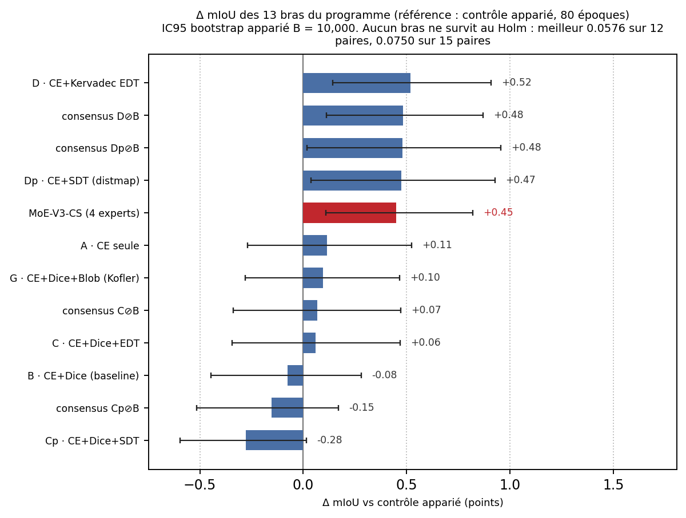
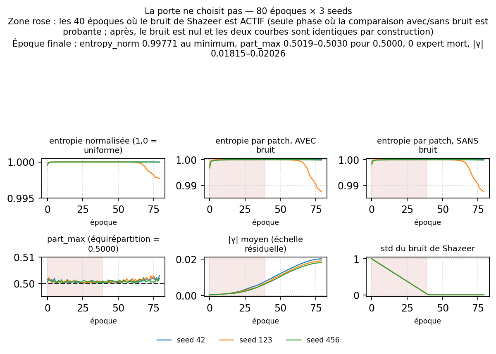
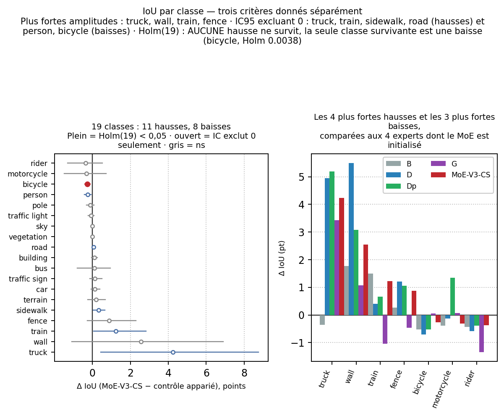
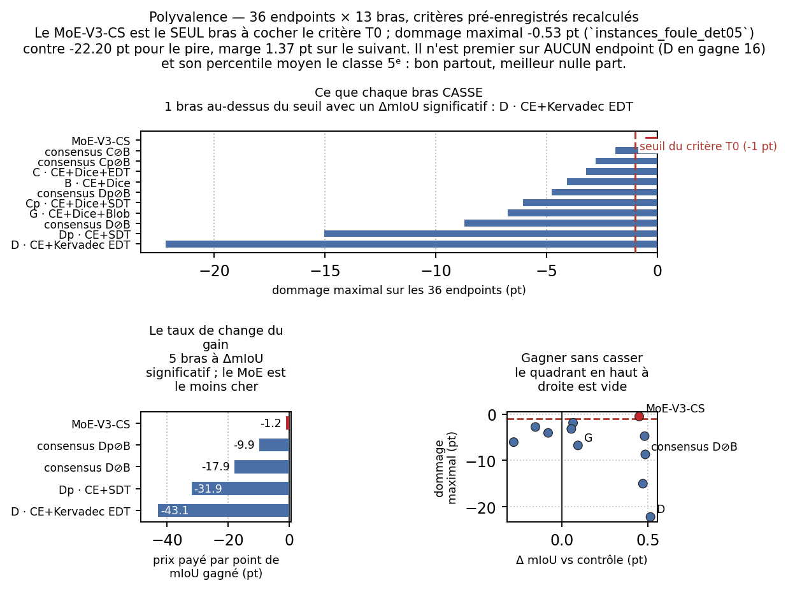

---
header-includes:
  - \usepackage{float}
  - \floatplacement{figure}{H}
  - \usepackage{booktabs}
---

# La porte ne choisit toujours pas : un mélange d'experts initialisé depuis des spécialistes de loss bat son contrôle apparié et reste le seul bras polyvalent sous les métriques Cityscapes pleine résolution

**Guillaume Cassez · Stanislas Larnier**

Recherche indépendante

*Guillaume Cassez* — [ORCID 0009-0007-0987-3931](https://orcid.org/0009-0007-0987-3931) · `cassez.guillaume@gmail.com` · [guillaume-cassez.fr](https://guillaume-cassez.fr)  
*Stanislas Larnier* — `stanislaslarnier@gmail.com` · [HAL stanislas-larnier](https://cv.hal.science/stanislas-larnier)

*Liste d’auteurs établie le 2026-10-04 — Stanislas Larnier rejoint ce papier en deuxième position, par accord mutuel entre les deux auteurs, comme sur les quatre papiers BRATS du même programme. Les versions déposées sur Zenodo avant cette date portent Guillaume Cassez seul. Aucun chiffre du manuscrit n’est modifié.*

*Cityscapes val · ConvNeXt-V2-Base + UPerNet · quatre experts initialisés depuis les spécialistes de loss B, D, Dp, G · porte top-2 par patch sur une grille 3×3 · 3 seeds × 80 époques à 1024×2048, contre un contrôle apparié en recette sans MoE*

---

## Résumé

On rapporte une évaluation **pré-enregistrée** et contrôlée de **MoE-V3-CS**, un **mélange d'experts** par patch inséré dans un segmenteur Cityscapes pleine résolution (ConvNeXt-V2-Base + UPerNet, 1024×2048, 19 classes, BF16). Ses quatre experts sont **initialisés bit à bit depuis le bloc `head.fpn_convs.0` de quatre spécialistes de loss entraînés indépendamment, du même seed** — B (CE+Dice), D (CE+Kervadec EDT), Dp (CE+SDT carte de distance), G (CE+Dice+0,5·blob) — puis une porte top-2 sur des patches 3×3 est entraînée 80 époques depuis une échelle résiduelle γ initialisée à zéro, de sorte que l'époque 0 est bit-exacte au contrôle. Le **critère primaire pré-enregistré** est la mIoU officielle dataset-level (cityscapesScripts, 19 classes) sur le holdout partagé de 500 images val, MoE-V3-CS contre son **contrôle apparié en recette** (même initialisation B, même recette, 80 époques, sans couche MoE), bootstrap apparié par image B = 10 000, les trois seeds moyennés dans chaque réplicat.

Le critère primaire est **positif au seuil brut et dans la famille pré-enregistrée à une paire** : Δ = **+0,449 pt** (MoE 81,618 contre contrôle 81,168), IC95 [+0,109 ; +0,820], p bilatéral = **0,0066**, Holm = 0,0066 sur la famille à 1 paire. Il **ne survit pas aux familles exploratoires de multiplicité** : Holm = 0,0726 sur 12 paires et Holm = 0,0924 sur 15 paires — et **aucun bras du plateau n'y survit non plus** (meilleur 0,0750). Les trois familles sont rapportées ensemble, aucune n'est choisie parce qu'elle arrange. Le résultat central est un **diagnostic de routage** : à l'époque finale la distribution de la porte est plate (entropie normalisée minimale 0,99771 sur les trois seeds, `part_max` 0,5030 / 0,5019 / 0,5019 contre 0,5000 pour l'équirépartition exacte, chaque expert entre 49,79 % et 50,30 % des patches, **zéro expert mort**), pourtant γ croît de 0,00024 à ≈ 0,020 (×77 à ×84) — le mélange **sert**, mais comme **moyenne d'experts**, pas comme sélection. Le gain ne vient pas du routage ; il vient de l'initialisation par experts. Cela **réplique sur un second dataset, une seconde architecture et un second point d'accroche** le résultat BRATS *The Gate Does Not Choose* [DOI 10.5281/zenodo.22903668], dont ce papier est une réplication, pas une republication : aucun chiffre BRATS n'est repris.

Sur le critère de polyvalence pré-enregistré du programme (36 endpoints × 13 bras), MoE-V3-CS est le **seul polyvalent** : dommage maximal **−0,53 pt** (instances-foule det@0,5) contre −1,90 (consensus C⊘B) et −22,20 (D, précision pixel piéton 70,0 → 47,8), une marge de 1,37 pt sur le bras suivant, et le plateau le moins cher du champ à **−1,2 pt de dommage par point de mIoU** contre −43,1 pour D. Il n'est pourtant **premier sur aucun des 36 endpoints** (D en gagne 16) et son percentile moyen est 60,4 (5^e^ sur 11) : *bon partout n'est pas meilleur partout*. Deux métriques métier survivent au Holm de la famille 15 paires — `fragments` (−31,2 composantes connexes par image) et `instances_taille_T3_rappel` (+0,26 pt, rappel des plus grandes instances) — tandis qu'aucune hausse d'IoU par classe ne survit au Holm des 19 classes (la seule survivante est une baisse, bicycle 0,0038).

**Contributions.** (1) Un **primaire positif pré-enregistré** pour un mélange initialisé par experts contre son contrôle apparié en recette, rapporté avec ses **trois** familles de multiplicité ensemble et la mention explicite qu'il ne survit pas à la famille exploratoire. (2) Un **diagnostic de routage qui sépare une tautologie d'une preuve** : l'égalité `entropy_token == entropy_token_clean` à l'époque finale est vraie *par construction* (le bruit de Shazeer y est recuit à zéro) et ne prouve rien ; la comparaison probante porte sur les 40 époques à bruit actif, où la distribution sans bruit est déjà plate (≥ 0,99821) et `part_max` reste dans [0,50011 ; 0,50217] de l'équirépartition 0,5000. (3) Le nommage correct de deux grandeurs de routage routinely confondues — `sum(frac) == top_k` (= 2), pas 1, et `top_expert_share` (moyenne des maxima par batch, 0,667 à l'époque 0) ≠ `part_max` (maximum des moyennes par batch, 0,501). (4) Un **verdict de polyvalence recalculé depuis les deltas et les rangs bruts**, chaque rang portant le dénominateur de son propre endpoint (le pire rang du MoE est 11/12 sur `instances_foule_rappel`, car le bras A est en couverture partielle et le dénominateur n'est donc pas constant). (5) Une **différence architecturale mesurée avec BRATS** : le garde-fou résiduel γ est indispensable ici (sans lui la recette brute coûte −28,1 points de mIoU à l'époque 0) et absent là-bas. (6) Publication du code, des configs, des tables, des figures et des scripts de régénération.

---

## 1. Introduction

Un segmenteur sémantique entraîné avec une seule loss est un généraliste : il est correct partout et excellent nulle part. Une idée naturelle est de construire plusieurs **spécialistes** — chacun entraîné avec une loss différente qui favorise un comportement différent (recouvrement de région, précision de contour, régression de distance, équilibre par instance) — puis de les **combiner**. Deux voies de combinaison existent dans ce programme. La première est le **consensus sans entraînement** : exécuter les spécialistes et fusionner leurs prédictions avec un veto de composantes connexes (les bras C⊘B / D⊘B). La seconde, étudiée ici, est un **mélange d'experts interne** : insérer une porte par patch sur des experts *initialisés depuis les spécialistes eux-mêmes*, et entraîner la porte (et une échelle résiduelle) sur un budget court pendant que les experts partent de poids réels et différenciés.

Le volet BRATS de ce programme a déjà parcouru la seconde voie et publié un résultat contre-intuitif, *The Gate Does Not Choose* [DOI 10.5281/zenodo.22903668 ; concept 10.5281/zenodo.22776410] : le mélange battait sa baseline, mais la distribution de la porte restait **plate** — le gain venait de la *moyenne* d'experts bien initialisés, pas de la *sélection* par la porte du bon expert par patch. Ce papier pose la question de savoir si ce résultat est une propriété de l'architecture BRATS (MedNeXt, 3D, GroupNorm, sigmoid region-based) ou une propriété de la **méthode** :

> Sur un dataset différent, une architecture différente, un régime de probabilités différent et un point d'accroche différent, un mélange par patch initialisé par experts bat-il toujours son contrôle apparié — et sa porte ne choisit-elle toujours pas ?

Le cadre est un bras contrôlé d'un programme de quatre papiers sur les losses, sur Cityscapes à 1024×2048 avec ConvNeXt-V2-Base + UPerNet : une étude de régression auxiliaire par carte de distance [Cassez 2026a, DOI 10.5281/zenodo.21006236], une ablation de boundary loss dont le bras B (CE+Dice) fournit à la fois l'initialisation et le contrôle apparié en recette utilisés ici [Cassez 2026b, DOI 10.5281/zenodo.21006393], une étude blob loss dont le bras G sert d'expert 3 [Cassez 2026c, DOI 10.5281/zenodo.23083560], et ce rapport sur un mélange d'experts. La réponse, mesurée avant la rédaction de ce manuscrit et pré-enregistrée dans la chaîne d'artefacts du programme (protocole P3.10), est **oui aux deux questions** : le mélange bat son contrôle apparié (Δ +0,449 pt, p = 0,0066), et sa porte ne choisit pas (routage plat, zéro expert mort, γ > 0). La contribution n'est donc pas une revendication de performance — après correction de Holm exploratoire aucun bras du plateau n'est significatif sur la mIoU — mais une **réplication d'un mécanisme** (moyenne, pas sélection) et un **diagnostic de polyvalence** (le seul bras qui n'est cassé nulle part).

---

## 2. Travaux connexes

**Mélange d'experts.** La porte creuse sur experts de Shazeer *et al.* [2017] et le routage top-k de Lepikhin *et al.* [2020] établissent la porte à équilibrage de charge et bruit injecté que ce papier utilise telle quelle (loss d'équilibrage switch, bruit gaussien additif sur les logits recuit au fil de l'entraînement). Ces travaux font grossir des experts *transformer* et s'appuient sur la porte pour les spécialiser. Le cadre présent est l'inverse : quatre experts *convolutifs* qui existent déjà, différenciés non par la pression de routage mais par la **loss avec laquelle ils ont été entraînés**, et un budget de fine-tuning court. La question est alors de savoir si la porte les re-spécialise ou se contente d'en faire la moyenne.

**Mélange d'experts initialisé depuis des spécialistes.** Le MoE-V3 BRATS [Cassez & Larnier 2026, DOI 10.5281/zenodo.22903668] entraîne une porte top-2 par patch sur quatre experts initialisés depuis des bras spécialistes entraînés indépendamment, et rapporte que la porte reste plate pendant que le mélange gagne. Ce papier transpose ce design à Cityscapes — dataset différent (conduite urbaine 2D vs gliome 3D), backbone différent (ConvNeXt-V2-Base + UPerNet vs MedNeXt), point d'accroche différent (`head.fpn_bottleneck` vs `dec_block_0`), métriques différentes (mIoU dataset-level / contours / rappel d'instances vs Dice lésion-wise / HD95), régime de probabilités différent (softmax exclusif vs sigmoid region-based). Il cite le papier BRATS comme **antériorité** et comme point de comparaison qualitative ; il ne reprend **aucun** de ses chiffres.

**Combiner des segmenteurs sans entraînement.** L'ensembling et le consensus de composantes connexes sont l'alternative sans entraînement. Dans ce programme, les bras de consensus (C⊘B, D⊘B, Cp⊘B, Dp⊘B) fusionnent les prédictions de deux spécialistes avec un veto CC qui supprime les fragments parasites à faible coût mIoU [Cassez 2026b] ; sur BRATS la règle analogue est publiée dans [DOI 10.5281/zenodo.22904810]. La §6.4 compare le mélange à ces bras de consensus sur le même plateau de 13 bras : deux d'entre eux (D⊘B, Dp⊘B) atteignent une amplitude mIoU légèrement supérieure au mélange, mais chacun porte un dommage maximal de −8,70 et −4,77 pt respectivement, contre −0,53 pt pour le mélange.

**Spécialistes de loss comme experts.** Les quatre experts de ce mélange sont exactement les bras étudiés dans les papiers compagnons : CE+Dice [Cassez 2026b], CE+Kervadec boundary/EDT [Kervadec 2019 ; Cassez 2026b], régression auxiliaire CE+SDT par carte de distance [Cassez 2026a], et CE+Dice+0,5·blob [Kofler 2023 ; Cassez 2026c]. Chacun est un *spécialiste dominé* sur le critère de polyvalence de la §5.5 — excellent sur les endpoints que sa loss cible, cassé ailleurs — ce qui rend précisément leur combinaison informative : si le mélange se contentait d'en faire la moyenne il hériterait de leurs cassures ; la mesure montre que non.

---

## 3. Méthode — un mélange par patch initialisé par experts

**Base.** ConvNeXt-V2-Base [Woo 2023] pré-entraîné ImageNet-22K (FCMAE) puis fine-tuné sur ImageNet-1K, + tête UPerNet [Xiao 2018], pleine résolution d'entrée 1024×2048 sans recadrage, 19 classes Cityscapes, autocast BF16, channels_last.

**Point d'accroche.** Une couche `PatchMoE2D` est insérée comme **dernier élément** du Sequential `head.fpn_bottleneck` (indices conservés : 0 = conv, 1 = BN, 2 = ReLU, 3 = MoE), de sorte que le bloc calcule `fused ← fused + experts(fused)` ; le résiduel est porté par la couche MoE elle-même (`src/moe/moe_model.py:attach_patch_moe`). Le checkpoint du contrôle B se charge en `strict=False` et les *seules* clés manquantes sont celles de la couche MoE (vérifié à l'exécution, sinon le run est arrêté).

**Experts.** Quatre experts, chacun initialisé depuis le bloc **`head.fpn_convs.0`** de l'un des quatre spécialistes de loss **du même seed**, tous entraînés 160 époques : expert 0 ← B (CE+Dice, qui fournit aussi backbone+tête), expert 1 ← D (CE+Kervadec), expert 2 ← Dp (CE+SDT DistMap), expert 3 ← G (CE+Dice+0,5·blob). Chaque copie est vérifiée **bit à bit** : l'écart maximal est **0,0** sur les 4 experts × 3 seeds (12 copies), et chaque expert est apparié au *même seed* que son run — d'où un appariement strict par seed. Le choix du bloc est verrouillé par un audit (`src/moe/AUDIT_DIVERSITE_EXPERTS.md`) : la distance de Frobenius relative entre experts est médiane **0,538** inter-méthodes (min-max 0,422-0,568, les 15 paires ≥ 0,42) contre **0,122** pour un bloc de backbone, et le drift de spécialisation est **non reproductible d'un seed à l'autre** (cosinus ≈ +0,001 à +0,008, plancher de bruit 1/√N ≈ 0,0007), d'où l'appariement par seed. La porte est **aléatoire** à l'initialisation (aucun pré-appariement).

**Routage.** Top-**2** parmi 4 experts, grille de patches **3×3**, gate convolutif (kernel 3, `Conv→GELU→Conv1×1` + average-pool sur la grille), loss d'équilibrage **switch** au poids 0,001 (auxiliaire pondéré 0,0020), **bruit de Shazeer** std 1,0 × std(logits) **recuit sur 40 époques**, échelle résiduelle initialisée à **0**. L'équirépartition exacte de `part_max` pour top-2 parmi 4 experts est **0,5000** (= top_k / n_experts, calculée, jamais écrite en dur) ; c'est la référence contre laquelle la §5.2 lit le routage.

**Garde-fou résiduel γ (une différence mesurée avec BRATS).** Sans échelle résiduelle, la recette BRATS brute coûte **−28,1 points de mIoU à l'époque 0** sur cette architecture (accord pixel 91,5 %, camion −87, cavalier −78, feu −70 ; mesuré en P3.08), parce que les experts initialisés depuis `head.fpn_convs.0` reçoivent au point d'accroche une distribution qu'ils n'ont jamais vue (la sortie de `fpn_bottleneck`), sans renormalisation avant le classifier — problème absent côté BRATS (blocs MedNeXt identiques partout + GroupNorm). Avec **γ = 0 initial, apprenable par canal**, l'époque 0 est **bit-exacte au contrôle B**, et |γ| devient un diagnostic direct de la thèse (|γ| → 0 = le mélange est inutile). Mesuré : |γ| ≈ 0,020 en fin d'entraînement (§5.2).

**Contrôle apparié.** `control_nomoe_Binit` : même initialisation B, même recette, **80 époques**, *sans* la couche MoE (3 seeds). C'est la référence du critère primaire — pas B (160 époques), pas le contrôle non apparié.

**Recette (mélange et contrôle).** 80 époques, batch 2 × accumulation de gradient 4 (effectif 8), AdamW (lr 6×10⁻⁵, weight decay 0,01, betas (0,9 ; 0,999)), décroissance polynomiale (power 1,0, warmup 1 époque), BF16, flip horizontal p = 0,5.

**Deux grandeurs de routage, correctement nommées.** `frac` est la part des *patches* traités par chaque expert (`onehot.clamp_max(1).mean(0)`, `src/moe/patch_moe2d.py`) ; comme chaque patch active top_k experts, **`sum(frac) == top_k` (= 2,0), pas 1**. `top_expert_share` est la **moyenne des maxima par batch** (la moyenne, sur les batches, de la part du plus grand expert) tandis que `part_max` est le **maximum des moyennes par batch** (la part du plus grand expert moyennée sur les batches) ; par Jensen `top_expert_share ≥ part_max` (mesuré 0,667 contre 0,501 à l'époque 0). Aucune des deux n'est « la part des patches traités par le premier expert » ; les confondre ferait passer une porte plate pour une porte qui choisit.

---

## 4. Cadre expérimental

### 4.1 Données, holdout, métriques

Annotations fines Cityscapes [Cordts 2016] : 2 975 images train / 500 val, 19 classes d'évaluation. Toutes les évaluations tournent sur le **holdout partagé pré-spécifié** du programme : les 500 premières images val dans l'ordre du loader (`first:500`) — identique pour les 13 bras, fixé avant l'entraînement de tout bras ; ce n'est *pas* un tirage aléatoire. Le leaderboard officiel Cityscapes n'a **pas** fait l'objet d'une soumission (limite déclarée, §7).

* **mIoU** — dataset-level, depuis une matrice de confusion agrégée unique, estimateur validé **bit-identique à la routine officielle `cityscapesScripts`** (`tests/test_official_miou.py`). IoU par classe depuis les mêmes matrices.
* **Boundary F1 (3 px)** — F1 par classe des contours prédits vs GT dans une tolérance de 3 pixels [protocole de Perazzi 2016] ; aussi restreint à {person, rider}.
* **Métriques d'instances piétonnes** — depuis les cartes officielles `*_gtFine_instanceIds.png`, classes {person, rider} : rappel strict, detection@0,5, précision pixel piéton ; **strates** = toutes / individuelles (instId ≥ 1000) / groupes-foule (instId < 1000), et **terciles de taille** T1 (plus petit) / T2 / T3 (plus grand) des instances individuelles.
* **Fragments** — composantes connexes à 8-voisins par image sommées sur les 19 masques de classe (`count_fragments`, `src/postprocessing/consensus.py`).

### 4.2 Critère primaire pré-enregistré et statistique

Le seul critère primaire pré-enregistré est la **mIoU officielle dataset-level, MoE-V3-CS vs son contrôle apparié en recette** (`moe_v3cs` vs `controle`). Test : **bootstrap apparié par image** sur les 500 images du holdout — positions re-tirées avec remplacement, **B = 10 000** réplicats, seed de bootstrap **20260618**, les trois seeds (42, 123, 456) moyennés *dans chaque réplicat*, IC percentile 95 %, p bilatéral = 2·min(frac Δ ≤ 0, frac Δ ≥ 0). Le critère a été déclaré avant les runs d'analyse (protocole P3.10). La famille primaire est la paire unique pré-enregistrée, donc Holm = p là.

**Trois familles de multiplicité, toutes rapportées.** Le même contraste appartient à trois familles de Holm différentes selon le protocole qui le déclare : la paire unique pré-enregistrée (P3.10, taille 1), la table master des bras-contre-contrôle (P3.14, taille 12), et la famille exploratoire du programme qui ajoute les quatre comparaisons fusion-vs-expert (P3.16, taille 15). Les tailles de famille sont **calculées** depuis les artefacts (`len(pairwise)`), et chaque valeur de Holm est **recomputée** depuis les p bruts puis comparée à la valeur stockée (accord < 1×10⁻¹², check bloquant). C'est la discipline maison héritée de l'erratum v1.1.0 du paper4, où une étiquette de famille écrite à la main avait fini par mal étiqueter les valeurs qu'elle portait.

**Deux critères de significativité, jamais confondus.** *Holm-significatif* (p corrigé < 0,05 dans la famille déclarée) et *IC-excluant-zéro* (IC95 brut) sont rapportés **séparément** partout ; le gras dans les tables marque la significativité Holm seulement. Cela compte ici : par ex. truck +4,24 IoU exclut zéro mais ne survit pas au Holm des 19 classes (0,1188).

**Non-déterminisme, déclaré.** cuDNN benchmark est actif (`deterministic: false`, BF16). Les chiffres primaires viennent du forward harnais de l'artefact pré-enregistré (P3.10) ; la régénération métier (§5.3) vient d'un second forward GPU indépendant des *mêmes* checkpoints. Les deux concordent à **8,58×10⁻⁴ pt** près sur le Δ primaire (+0,449360 contre +0,450218), du même ordre que les 4,13×10⁻³ pt déjà documentés dans la sanity de consolidation du programme ; le verdict est identique dans les deux.

---

## 5. Résultats

### 5.1 Critère primaire : positif au seuil brut, ne survit pas à la famille exploratoire

Primaire pré-enregistré, bootstrap apparié par image sur le holdout de 500 images (artefact `results/moe_v3_cs/harness/table_controle_v3cs_P310.json`) :

| Quantité | MoE-V3-CS | contrôle apparié |
|---|---|---|
| mIoU (point) | **81,618** | **81,168** |
| IC95 | [80,264 ; 82,709] | [79,802 ; 82,251] |
| mIoU seed 42 | 81,814 | 81,561 |
| mIoU seed 123 | 81,339 | 80,556 |
| mIoU seed 456 | 81,701 | 81,388 |

**Δ(MoE − contrôle) = +0,449 pt · IC95 [+0,109 ; +0,820] · p = 0,0066 → significatif au seuil brut.**

Les trois familles de multiplicité, données ensemble (tailles calculées depuis les artefacts, Holm recomputé depuis les p bruts) :

| Famille | Taille | Holm du primaire | Artefact source |
|---|---|---|---|
| paire unique pré-enregistrée (P3.10) | 1 | **0,0066** (= p) | `harness/table_controle_v3cs_P310.json` |
| bras contre contrôle (P3.14) | 12 | 0,0726 | `p314/master_table.json` |
| exploratoire du programme (P3.16) | 15 | 0,0924 | `metiers_experts/table_metiers_experts.json` |

Lecture honnête : le critère primaire est significatif au seuil brut (p = 0,0066) et **dans la famille pré-enregistrée à 1 paire** (Holm = 0,0066). Il **ne survit pas à la famille exploratoire à 15 paires** (Holm = 0,0924 > 0,05) — et **aucun bras du plateau n'y survit non plus** (meilleur Holm 0,0750). Écrit tel quel : sur la mIoU, les conclusions de ce programme reposent sur les **ampleurs et leurs IC**, et la contribution de ce papier porte sur ce que chaque bras **casse** (§5.3), pas sur la significativité post-Holm de la mIoU.

**Robustesse inter-forwards.** Un second forward GPU indépendant des mêmes checkpoints (chemin de régénération métier, §5.3) donne Δ = +0,450218 pt contre +0,449360 pt pour le harnais — un écart de **8,58×10⁻⁴ pt** (6,07×10⁻⁴ pt sur la mIoU du MoE, 2,51×10⁻⁴ pt sur celle du contrôle), soit le non-déterminisme cuDNN/BF16. Même verdict dans les deux sources.

*Figure 1 : Δ mIoU vs le contrôle apparié pour les 13 bras du programme (bootstrap apparié, B = 10 000). MoE-V3-CS est 5^e^ par amplitude ; les deux familles de Holm sont toutes deux rapportées dans la table T3.*

**Position parmi les 13 bras** (référence : contrôle apparié ; artefact `results/moe_v3_cs/p314/master_table.json`). Les deux familles de Holm sont données, avec leur taille calculée depuis l'artefact :

| # | Bras | mIoU | Δ vs contrôle | IC95 | p | Holm (12 paires, P3.14) | Holm (15 paires, P3.16) |
|---|---|---|---|---|---|---|---|
| 1 | D · CE+Kervadec EDT | 81,686 | +0,518 | [+0,142 ; +0,910] | 0,0048 | 0,0576 | 0,0750 |
| 2 | consensus D⊘B | 81,652 | +0,484 | [+0,111 ; +0,871] | 0,0082 | 0,0820 | 0,1066 |
| 3 | consensus Dp⊘B | 81,647 | +0,479 | [+0,019 ; +0,957] | 0,0396 | 0,3168 | 0,4136 |
| 4 | Dp · CE+SDT (distmap) | 81,643 | +0,475 | [+0,038 ; +0,927] | 0,0312 | 0,2808 | 0,3960 |
| 5 | **MoE-V3-CS (4 experts) ← ce papier** | **81,618** | **+0,449** | **[+0,109 ; +0,820]** | **0,0066** | **0,0726** | **0,0924** |
| 6 | A · CE seule | 81,283 | +0,115 | [−0,271 ; +0,525] | 0,5722 | 1,0000 | n.c. (a) |
| 7 | G · CE+Dice+Blob (Kofler) | 81,263 | +0,095 | [−0,279 ; +0,467] | 0,6552 | 1,0000 | 1,0000 |
| 8 | consensus C⊘B | 81,236 | +0,068 | [−0,338 ; +0,472] | 0,7758 | 1,0000 | 1,0000 |
| 9 | C · CE+Dice+EDT | 81,227 | +0,059 | [−0,344 ; +0,468] | 0,8096 | 1,0000 | 1,0000 |
| 10 | B · CE+Dice (baseline) | 81,093 | −0,075 | [−0,447 ; +0,281] | 0,6748 | 1,0000 | 1,0000 |
| 11 | consensus Cp⊘B | 81,014 | −0,154 | [−0,516 ; +0,170] | 0,3498 | 1,0000 | 1,0000 |
| 12 | Cp · CE+Dice+SDT | 80,890 | −0,278 | [−0,597 ; +0,016] | 0,0628 | 0,4396 | 0,6180 |
| — | contrôle (CE+Dice 80 ep, réf) | 81,168 | 0 (réf) | — | — | — | — |

(a) A est hors de la famille 15 paires (couverture partielle). Le MoE-V3-CS est **5^e^ sur 12** par amplitude (5^e^ sur 13 avec le contrôle, qui à Δ = 0 se classe 10^e^). **5 bras ont un p brut < 0,05 ; aucun ne survit au Holm**, ni sur 12 paires (meilleur 0,0576) ni sur 15 (meilleur 0,0750). C'est le point de bascule du papier : puisque l'amplitude de mIoU ne sépare pas les bras de façon significative après correction, la conclusion porte sur **ce que chaque bras casse** (§5.3), où le MoE-V3-CS est premier avec une marge mesurée.

### 5.2 Diagnostic de routage : la porte ne choisit pas

Relevé dans `routing_moe_v3cs_Binit_seed*.jsonl` (80 époques × 3 seeds), croisé avec les `final_epoch_stats` des summaries (identité vérifiée à 1×10⁻¹² sur 8 grandeurs × 3 seeds). Équirépartition exacte de `part_max` pour top-2 parmi 4 experts = **0,5000** (calculée `top_k / n_experts`).

| Grandeur | époque 0 (seed 42/123/456) | époque finale (seed 42/123/456) | référence | lecture |
|---|---|---|---|---|
| `entropy_norm` | 0,99970 / 0,99967 / 0,99955 | **1,00000 / 0,99771 / 0,99997** | 1,0 = uniforme | porte quasi uniforme |
| `part_max` | 0,50056 / 0,50149 / 0,50149 | **0,5030 / 0,5019 / 0,5019** | 0,5000 = équirépartition | écart max 0,0030 |
| `frac` des 4 experts | — | [0,4979 ; 0,5030] | 0,5000 | aucun expert favorisé |
| experts morts (`frac` = 0) | — | **0** | 0 | aucun effondrement |
| `top_expert_share` | 0,66700 / 0,66898 / 0,65957 | 0,59755 / 0,59546 / 0,59695 | 1,0 = un seul expert | moyenne des maxima par batch, quasi stable |
| `noise_std` | 1,00 / 1,00 / 1,00 | 0,00 / 0,00 / 0,00 | recuit sur 40 époques | exploration éteinte, la platitude subsiste |
| γ (`gamma_absmean`) | 0,00024 / 0,00023 / 0,00023 | **0,02026 / 0,01912 / 0,01815** | 0 = MoE inutile | strictement positif, ×77 à ×84 |

**Lecture.** À l'époque finale, la distribution de routage est plate à 99,771 % d'entropie normalisée minimale, `part_max` vaut 0,5030 / 0,5019 / 0,5019 contre 0,5000 pour l'équirépartition exacte, les quatre experts reçoivent entre 49,79 % et 50,30 % des patches, et **aucun expert n'est mort**. La porte ne choisit donc pas : elle moyenne.

**Ce n'est pas un artefact du bruit de Shazeer — et la preuve n'est pas celle qu'on croit.** À l'époque finale le bruit est recuit à 0, donc `entropy_token_clean` est *identique par construction* à `entropy_token` : cette égalité-là ne prouve rien (c'est une tautologie). La comparaison **probante** porte sur les **40 époques où le bruit est actif** (std 1,0 × std des logits) : l'écart maximal entre les deux entropies y est de **1,45×10⁻³** (seed 42 9,54×10⁻⁴, seed 123 9,95×10⁻⁴, seed 456 1,45×10⁻³), tandis que la distribution **sans bruit** y reste plate à **≥ 0,99821** d'entropie normalisée et `part_max` y reste entre **[0,50011 ; 0,50217]** de l'équirépartition 0,5000. Autrement dit : la platitude du routage est une propriété de la *porte*, pas du bruit qu'on lui injecte.

*Figure 2 : diagnostics de routage au fil de l'entraînement. Haut : le `frac` par expert reste collé à 0,5000 (équirépartition) sans expert mort. Milieu : l'entropie sans bruit reste ≥ 0,99821 pendant les 40 époques à bruit actif. Bas : γ croît de 0,00024 à ≈ 0,020 — le mélange sert, mais comme moyenne.*

Pourtant le mélange **sert** : γ, l'échelle résiduelle apprenable par canal (initialisée à 0,0 pour rendre l'époque 0 bit-exacte au contrôle), atteint 0,02026 / 0,01912 / 0,01815 en fin de run contre 0,00024 / 0,00023 / 0,00023 à l'époque 0 (×77 à ×84). Le gain vient donc de la **moyenne d'experts**, pas de la sélection — la réplication, sur Cityscapes, du résultat BRATS, avec une autre architecture et un autre point d'accroche.

**Limite écrite telle quelle.** `entropy_token` du seed 123 (0,98745) est très légèrement sous les deux autres (0,99996, 0,99982) : la thèse tient sur les 3 seeds mais n'est pas d'une uniformité parfaite sur celui-ci.

### 5.3 Métriques métier : ce que le mélange capte, ce qu'il paie

Holdout `first:500`, seeds moyennés dans chaque réplicat, bootstrap apparié B = 10 000 (seed 20260618), Holm sur la famille à **15 paires**. Unités : points (×100), sauf `fragments` = composantes connexes par image. **Gras = Holm < 0,05.** Les deux critères (Holm et IC-excluant-zéro) sont séparés, jamais confondus.

| Métrique | n | contrôle | MoE-V3-CS | Δ(MoE−ctl) | IC95 | p | Holm(15) | verdict |
|---|---|---|---|---|---|---|---|---|
| `mIoU` | 500 | 81,168 | 81,618 | +0,450 | [+0,110 ; +0,818] | 0,0066 | 0,0924 | IC exclut 0, ne survit pas au Holm |
| `boundary_f1_3px` | 500 | 76,627 | 76,567 | −0,061 | [−0,178 ; +0,055] | 0,3004 | 1 | ns |
| `rappel_strict_instances` | 441 | 76,253 | 76,728 | +0,475 | [−0,004 ; +0,935] | 0,0516 | 0,2064 | ns |
| `precision_ped_pixels` | 473 | 70,028 | 70,024 | −0,004 | [−0,377 ; +0,376] | 0,9896 | 0,9896 | ns |
| `instances_toutes_rappel` | 441 | 79,975 | 80,372 | +0,397 | [−0,028 ; +0,766] | 0,0694 | 0,2776 | ns |
| `instances_individuelles_rappel` | 440 | 80,096 | 80,504 | +0,407 | [−0,030 ; +0,783] | 0,0662 | 0,2648 | ns |
| `instances_foule_rappel` | 63 | 74,584 | 74,199 | −0,384 | [−1,536 ; +0,493] | 0,4822 | 1 | ns |
| `instances_taille_T1_rappel` | 315 | 64,994 | 65,796 | +0,802 | [+0,073 ; +1,510] | 0,0330 | 0,198 | IC exclut 0, ne survit pas au Holm |
| `instances_taille_T3_rappel` | 335 | **93,474** | **93,733** | **+0,258** | **[+0,142 ; +0,384]** | 0,0000 | **0** | **Holm-significatif** |
| `IoU_person` | 500 | 85,152 | 84,910 | −0,242 | [−0,429 ; −0,062] | 0,0080 | 0,088 | IC exclut 0, ne survit pas au Holm |
| `IoU_rider` | 500 | 68,920 | 68,555 | −0,365 | [−1,302 ; +0,524] | 0,4298 | 1 | ns |
| `fragments` | 500 | **519,3** | **488,0** | **−31,2** | **[−35,7 ; −26,7]** | 0,0000 | **0** | **Holm-significatif** |

(table complète des 20 métriques dans `tables/T5_metiers.md`). Sur les 20 métriques métier, **2 survivent au Holm** sur la famille 15 paires — `instances_taille_T3_rappel` (+0,26 pt, rappel des plus grandes instances) et `fragments` (−31,2 composantes par image), toutes deux avec p = 0 — et **5 ont un IC excluant zéro**. Il serait faux de n'en nommer qu'une : les **deux** survivantes sont `fragments` et `instances_taille_T3_rappel`, et la seconde va *dans le sens de la thèse* : le seul gain métier qui résiste à la multiplicité porte sur les **grandes** instances (T3), tandis que le gain sur les **petites** (T1 +0,80) n'y résiste pas (Holm 0,198). Le mélange améliore ce qui est déjà bien vu et réduit la fragmentation ; il ne répare pas les plus petites instances.

**Ce que le mélange capte des experts, et ce qu'il n'hérite pas** (Δ vs contrôle, même artefact) :

| Métrique | Δ MoE | Δ D | Δ Dp | Δ G | lecture calculée |
|---|---|---|---|---|---|
| `instances_taille_T1_rappel` | +0,802 | +2,816 | +2,016 | −4,080 | capte une partie du gain de D/Dp |
| `rappel_strict_instances` | +0,475 | +2,183 | +1,719 | −3,417 | capte une partie du gain de D/Dp |
| `precision_ped_pixels` | −0,004 | −22,195 | −15,020 | −6,763 | perte, mais 0,00 ≪ −22,20 (D) |
| `instances_foule_rappel` | −0,384 | +1,511 | +1,319 | −4,612 | perte, mais 0,38 ≪ −4,61 (G) |
| `traffic light` (par classe) | −0,081 | −2,602 | −2,340 | +0,470 | n'hérite pas de la perte boundary/distmap |
| `boundary_f1_3px` | −0,061 | +0,677 | +0,545 | +0,376 | neutre |

Lecture calculée : le MoE-V3-CS capte une partie du gain d'instances de D/Dp (T1 +0,80 contre +2,82 et +2,02) **sans** hériter ni de leur perte `traffic light` (−0,08 contre −2,60 et −2,34) ni du rappel piéton massacré par G (+0,47 contre −3,42). Sa contrepartie mesurée : **aucun gain de contours** (`boundary_f1_3px` −0,061, ns) — cohérent avec la §5.2, une moyenne d'experts lisse les spécialités de contour. La pire famille du mélange est `contours` (−0,06 pt en moyenne) et c'est sa **seule** famille négative (1 sur 5).

### 5.4 IoU par classe : trois critères, donnés séparément

19 classes Cityscapes, référence = contrôle apparié, Holm sur la **famille des 19 classes** (recomputé depuis les p bruts, écart max 0,0). Gras = Holm(19) < 0,05. Sur les 19 classes : **11 en hausse, 8 en baisse**.

| Classe | IoU MoE | IoU ctl | Δ(MoE−ctl) | IC95 | p | Holm(19) | ΔD | ΔDp | ΔG | ΔB |
|---|---|---|---|---|---|---|---|---|---|---|
| truck | 84,834 | 80,593 | +4,241 | [+0,438 ; +8,752] | 0,0066 | 0,1188 | +4,94 | +5,19 | +3,43 | −0,35 |
| wall | 58,698 | 56,147 | +2,551 | [−1,085 ; +6,897] | 0,2000 | 1 | +5,49 | +3,08 | +1,07 | +1,77 |
| train | 83,463 | 82,234 | +1,229 | [+0,054 ; +2,820] | 0,0408 | 0,5712 | +0,40 | +0,66 | −1,04 | +1,50 |
| fence | 66,683 | 65,807 | +0,875 | [−0,271 ; +2,298] | 0,1586 | 1 | +1,21 | +1,06 | −0,46 | +0,26 |
| sidewalk | 87,296 | 86,975 | +0,321 | [+0,040 ; +0,660] | 0,0224 | 0,336 | +0,62 | +0,48 | +0,06 | +0,09 |
| road | 98,468 | 98,411 | +0,057 | [+0,013 ; +0,111] | 0,0078 | 0,1326 | +0,05 | +0,07 | +0,04 | +0,03 |
| person | 84,910 | 85,153 | −0,244 | [−0,433 ; −0,062] | 0,0078 | 0,1326 | −0,19 | −0,25 | +0,07 | −0,26 |
| bicycle | 80,068 | 80,333 | **−0,265** | [−0,408 ; −0,121] | 0,0002 | **0,0038** | −0,70 | −0,53 | +0,05 | −0,52 |

(lignes sélectionnées ; table complète des 19 classes dans `tables/T6_perclass.md`). Le classement par **amplitude** et le classement par **significativité** ne coïncident pas ; les confondre produirait une affirmation fausse. Les trois critères sont donnés tels quels :

1. **Plus fortes amplitudes** (Δ décroissant) : truck +4,24, wall +2,55, train +1,23, fence +0,88.
2. **IC excluant zéro** (le critère « significatif » de P3.16) : hausses truck +4,24, train +1,23, sidewalk +0,32, road +0,06 ; baisses person −0,24, bicycle −0,26.
3. **Holm sur la famille des 19 classes** : **aucune hausse ne survit** ; la seule classe survivante est une **baisse** — bicycle (Holm 0,0038).

C'est le point d'honnêteté central de cette table : le gain le plus spectaculaire (truck +4,24 pt) a un IC qui exclut zéro mais **ne survit pas** au Holm des 19 classes (0,1188), parce que son IC est large ([+0,44 ; +8,75]) sur une classe rare. Le seul effet par classe qui résiste à la correction multiple est un **coût** (bicycle), pas un gain. Les coûts sont faibles et distribués : bicycle −0,26, motorcycle −0,31, rider −0,37.

*Figure 5 : Δ IoU par classe. Le mélange retrouve 82 % du meilleur gain spécialiste sur truck (Dp +5,19) et 82 % sur train (où le meilleur expert est **B** +1,50, pas D ni Dp — un dénominateur limité à D/Dp aurait fait écrire « 186 % du meilleur gain spécialiste », ce qui ne veut rien dire), tout en gardant la perte traffic light à 3 % de celle de D et la perte piéton à 95 % de celle de B.*

### 5.5 Polyvalence : le seul polyvalent, premier sur rien

Le critère de polyvalence pré-enregistré du programme : **36 endpoints** (19 IoU par classe + 17 métriques métier) × 13 bras, même holdout et bootstrap. « Dommage maximal » = le pire Δ au niveau endpoint vs contrôle (plus proche de 0 = aucun point faible). Les critères T0-T4 ont été écrits **avant** lecture des résultats, et chaque verdict ci-dessous est **recalculé ici depuis les deltas et les rangs bruts**, puis comparé au verdict stocké — la thèse « seul bras polyvalent » est re-démontrée, pas recopiée.

| Critère | Énoncé | Résultat recalculé | Verdict |
|---|---|---|---|
| **T0** | ΔmIoU significatif **et** aucun des 36 endpoints à plus de 1 pt sous la référence **et** aucune des 19 classes dégradée de plus de 0,5 pt | 1 bras sur les 11 classés contre la référence : **MoE-V3-CS** | ✅ |
| **T1** | dommage maximal le plus faible du plateau | −0,53 pt (`instances_foule_det05`) contre −1,90 (consensus C⊘B) et −22,20 (D) — marge 1,37 pt | ✅ |
| **T2** | ΔmIoU significatif malgré tout | Δ +0,45 pt, p = 0,0066, Holm(12) 0,0726, Holm(15) 0,0924 | ✅ au seuil brut, ❌ après Holm exploratoire — écrit tel quel |
| **T3** | aucun endpoint gagné outright | 0 rang 1 sur 36 (D en a 16), pire rang 11/12 sur `instances_foule_rappel`, jamais dernier (0 dernière place) | ✅ |
| **T4** | verdict stable seed par seed | 1^er^ en dommage sur 2 seeds sur 3 (42, 456 ; seed 123 → 3^e^) | ❌ partiel |

**Dommage maximal par bras — le classement qui fonde la thèse** (table complète dans `tables/T7_polyvalence.md`) :

| Rang | Bras | dommage max (pt) | endpoint | z | ΔmIoU (pt) | p | prix par pt de mIoU | percentile moyen | pire rang | #1 |
|---|---|---|---|---|---|---|---|---|---|---|
| 1 | **MoE-V3-CS (4 experts)** | **−0,53** | `instances_foule_det05` | −0,35 | +0,45 | 0,0066 | −1,2 | 60,4 | 11/12 | 0 |
| 2 | consensus C⊘B | −1,90 | `IoU_bus` | −1,47 | +0,07 | 0,7866 | — | 44,0 | 13/13 | 0 |
| 6 | consensus Dp⊘B | −4,77 | `precision_ped_pixels` | −0,74 | +0,48 | 0,0376 | −9,9 | 69,0 | 12/12 | 4 |
| 9 | consensus D⊘B | −8,70 | `precision_ped_pixels` | −1,35 | +0,49 | 0,0082 | −17,9 | 71,9 | 12/13 | 3 |
| 10 | Dp · CE+SDT (distmap) | −15,02 | `precision_ped_pixels` | −2,32 | +0,47 | 0,0330 | −31,9 | 72,7 | 13/13 | 3 |
| 11 | D · CE+Kervadec EDT | −22,20 | `precision_ped_pixels` | −3,44 | +0,52 | 0,0050 | −43,1 | 77,3 | 13/13 | 16 |

« Prix par point de mIoU » = dommage maximal divisé par le ΔmIoU, pour les bras dont le ΔmIoU est significatif au seuil brut : c'est le taux de change entre le gain global et ce que le bras casse. Le MoE-V3-CS est le moins cher du plateau d'un facteur mesuré (−1,2 contre −43,1 pour D).

**Tout rang porte le dénominateur de son propre endpoint.** Le pire rang du mélange est **11/12**, atteint sur `instances_foule_rappel` et `instances_foule_det05`. Le dénominateur n'est **pas constant** (ce n'est pas toujours 13) : le bras A est en couverture partielle (`annexe_couverture_partielle` de P3.17), classé sur seulement **20** des 36 endpoints, donc les 16 autres ne classent que **12** bras. « Jamais dernier » reste vrai (11 < 12, la dernière place y est 12), mais avec le bon dénominateur.

**Niveau moyen : « bon partout » ≠ « meilleur partout ».** En percentile moyen, D (77,3) > Dp (72,7) > consensus D⊘B (71,9) > **MoE-V3-CS (60,4, 5^e^ sur 11)**. Sur une cible unique, le spécialiste reste devant. Le mélange n'est premier sur **aucun** des 36 endpoints (D en gagne 16). Ce qu'il est le seul à faire, c'est n'être **cassé nulle part** : dommage maximal −0,53 pt là où D descend à −22,20 pt.

**Deux compteurs, à ne pas confondre** (tous deux calculés) : **22 des 36 endpoints sont au-dessus du contrôle** (Δ > 0 ; 14 en dessous, aucun nul) et **28 sont dans la moitié haute du classement** parmi les 12 bras (8 dans la moitié basse). Le second ne mesure pas un signe mais une **position relative** : un bras peut être dans la moitié haute tout en restant sous le contrôle, et inversement.

*Figure 4 : le verdict de polyvalence. Le mélange est premier en dommage maximal (−0,53 pt, marge 1,37 pt) mais 5^e^ en percentile moyen (60,4) et premier sur 0 des 36 endpoints — le polyvalent n'est pas le meilleur.*

**Stabilité seed par seed.** Le mélange est le bras le moins abîmé sur **2 seeds sur 3** (42, 456) ; le seed 123 le place 3^e^ derrière consensus C⊘B et Cp⊘B — mais ces deux bras ont un ΔmIoU de +0,07 et −0,15 pt (non significatifs) : ils ne cassent rien parce qu'ils ne font rien. C'est la raison pour laquelle T4 est déclaré **partiel** plutôt que passé.

---

## 6. Discussion

### 6.1 Pourquoi une moyenne d'experts bat une sélection

La porte reste plate (§5.2), pourtant le mélange bat son contrôle apparié (+0,449 pt, p = 0,0066) et γ croît jusqu'à ≈ 0,020. La lecture que les mesures soutiennent est que le gain vient de l'**initialisation par experts**, pas du routage : partir de quatre spécialistes différenciés (distance de Frobenius relative médiane 0,538 inter-méthodes) et en faire la moyenne avec une échelle résiduelle apprenable par canal produit une fonction qui est meilleure que le contrôle *partout en moyenne* sans jamais s'engager sur un expert par patch. C'est le même mécanisme que celui rapporté par le volet BRATS [DOI 10.5281/zenodo.22903668], sur une autre architecture et un autre point d'accroche — c'est l'argument de générosité de ce papier. La platitude est une propriété de la porte, pas du bruit injecté : pendant les 40 époques à bruit actif la distribution sans bruit est déjà plate (≥ 0,99821) et `part_max` reste à 0,00011-0,00217 de l'équirépartition.

### 6.2 Le garde-fou résiduel γ est un fait architectural, pas un réglage

γ n'était **pas** nécessaire côté BRATS (blocs MedNeXt identiques partout + GroupNorm : les experts voyaient au point d'accroche une distribution proche de celle sur laquelle ils avaient été entraînés). Il est **indispensable** ici : sans lui la recette brute coûte −28,1 points de mIoU à l'époque 0, parce que les latéraux UPerNet + BatchNorm présentent aux experts, en `head.fpn_bottleneck`, une distribution qu'ils n'ont jamais traitée et sans renormalisation avant le classifier. Initialiser γ à 0 rend l'époque 0 bit-exacte au contrôle, et fait de |γ| un diagnostic direct de la thèse : |γ| → 0 signifierait que le mélange est inutile ; |γ| ≈ 0,020 signifie qu'il contribue. C'est une différence **mesurée** entre les deux datasets, pas un réglage choisi après coup.

### 6.3 Pourquoi aucun gain par classe ne survit au Holm alors que le mélange gagne

Le seul effet par classe qui résiste au Holm des 19 classes est un **coût** (bicycle, −0,26, Holm 0,0038) ; le plus grand gain (truck +4,24) a un IC large sur une classe rare et ne survit pas. Ce n'est pas contradictoire avec le primaire positif : la mIoU est la *moyenne sur 19 classes*, et le mélange élève la moyenne en étalant de petits gains sur beaucoup de classes (11 hausses) tout en gardant les baisses faibles et distribuées (pire −0,37 sur rider). Un Holm par classe est sous-puissant pour exactement ce genre d'effet distribué — c'est pourquoi les conclusions du programme reposent sur les amplitudes et les IC, et sur le critère de polyvalence (§5.5) plutôt que sur la significativité par classe.

### 6.4 Relation aux bras de consensus

Deux bras de consensus sans entraînement (D⊘B +0,484, Dp⊘B +0,479) atteignent une amplitude mIoU légèrement supérieure au mélange (+0,449), et l'un (D⊘B) a un percentile moyen plus élevé (71,9 contre 60,4). Mais chaque bras de consensus porte un dommage maximal de −8,70 et −4,77 pt (précision pixel piéton), contre −0,53 pt pour le mélange, et chacun gagne outright sur 3 et 4 endpoints respectivement pendant que le mélange n'en gagne aucun. Le mélange n'est pas le bras le plus fort ; c'est le **seul qui n'est cassé nulle part**, ce qui est précisément la propriété que le critère pré-enregistré T0 a été écrit pour isoler.

---

## 7. Limites

1. **Holdout `first:500`.** Un sous-ensemble pré-spécifié du val, identique pour les 13 bras et fixé avant entraînement — mais *pas* un tirage aléatoire, et le leaderboard officiel n'a pas fait l'objet d'une soumission.
2. **Aucun bras significatif sur la mIoU après Holm.** Meilleur p brut = 0,0048 → Holm 0,0576 sur la famille 12 paires, 0,0750 sur la famille exploratoire 15 paires. Les conclusions du programme sur la mIoU reposent sur les amplitudes et les IC, écrites comme telles ; le primaire ne survit qu'à la famille pré-enregistrée à 1 paire.
3. **Un seul point d'accroche, une seule configuration de MoE.** `head.fpn_bottleneck` seulement ; 4 experts, top-2, grille 3×3 seulement. Aucun sweep sur le nombre d'experts, le point d'accroche, top_k ou la grille.
4. **Coût.** Les quatre experts doivent exister (4 × 160 époques) *plus* 80 époques de mélange et 80 de contrôle ; le mélange coûte **+24,7 % de temps par époque** (762 s contre 611 s) et **+3,7 Go de VRAM** (35,2 contre 31,5 Go) face au contrôle, ≈ 17,0 h par seed.
5. **Contrôle apparié en recette, pas en budget total.** Le contrôle entraîne 80 époques (la recette du mélange) ; un contrôle à 160 époques n'a pas été entraîné. La comparaison est appariée en *recette*, pas en calcul total.
6. **Seed 123 légèrement moins uniforme.** `entropy_token` 0,98745 contre 0,99996 / 0,99982 ; T4 (stabilité seed par seed) est **partiel** (1^er^ en dommage sur 2 seeds sur 3), pas passé.
7. **n = 3 seeds.** Les effets sous 0,5 pt sont sous-puissants au niveau seed ; l'inférence primaire est le bootstrap apparié sur 500 images, qui sonde l'échantillonnage du jeu d'évaluation, pas la variance inter-seeds.
8. **Non-déterminisme cuDNN/BF16 déclaré.** Deux forwards indépendants des mêmes checkpoints diffèrent de 8,58×10⁻⁴ pt sur le Δ primaire (verdicts identiques) ; des reruns GPU bit-exacts ne sont revendiqués nulle part.
9. **L'artefact de polyvalence mélange deux forwards.** Ses colonnes IoU par classe viennent de l'attribution P3.16 (Δ +0,449360) et sa colonne mIoU de la régénération métier (Δ +0,450218) ; l'identité « moyenne des 19 Δ par classe == ΔmIoU » est exacte *dans* un artefact (vérifié, écart 0) mais seulement à 8,58×10⁻⁴ pt près entre les deux — le même écart inter-forwards déclaré plus haut, pas une incohérence.

---

## 8. Conclusion

Insérer un mélange par patch dans un segmenteur Cityscapes pleine résolution, initialiser ses quatre experts bit à bit depuis quatre spécialistes de loss du même seed, entraîner la porte et une échelle résiduelle initialisée à zéro pendant 80 époques, et le résultat est : **le mélange bat son contrôle apparié en recette** (ΔmIoU +0,449 pt [+0,109 ; +0,820], p = 0,0066, Holm = 0,0066 dans la famille pré-enregistrée à 1 paire ; il ne survit pas à la famille exploratoire 15 paires, Holm = 0,0924, où aucun bras du plateau ne survit), **et sa porte ne choisit pas** — routage plat à l'époque finale (entropie normalisée minimale 0,99771, `part_max` à 0,0030 de l'équirépartition 0,5000, zéro expert mort), une platitude qui est une propriété de la porte et non du bruit recuit (sur les 40 époques à bruit actif la distribution sans bruit reste ≥ 0,99821), pendant que γ croît de 0,00024 à ≈ 0,020. Le gain vient de la **moyenne d'experts**, pas de la sélection — la réplication, sur un second dataset, une seconde architecture et un second point d'accroche, du résultat BRATS *The Gate Does Not Choose* [DOI 10.5281/zenodo.22903668], dont ce papier ne reprend aucun chiffre. Sur le critère de polyvalence à 36 endpoints du programme, le mélange est le **seul polyvalent** (dommage maximal −0,53 pt, marge 1,37 pt, prix −1,2 pt par point de mIoU contre −43,1 pour D) tout en étant **premier sur aucun** des 36 endpoints et 5^e^ en percentile moyen : bon partout n'est pas meilleur partout. La porte ne choisit toujours pas — et c'est exactement pourquoi le mélange est le seul bras qui n'est cassé nulle part.

Code, configs, pointeurs d'artefacts par bras, tables, figures et scripts de régénération : **github.com/guillaume-cassez/cityscape-moe-experts** (bundle de publication de ce papier). Compagnons de programme : Cityscapes distmap [DOI 10.5281/zenodo.21006236], ablation boundary Cityscapes [DOI 10.5281/zenodo.21006393], blob loss Cityscapes [DOI 10.5281/zenodo.23083560], MoE-V3 BRATS (antériorité) [DOI 10.5281/zenodo.22903668 ; concept 10.5281/zenodo.22776410].

---

## Contributions des auteurs

**Guillaume Cassez** (auteur principal) : conception de l'étude, entraînement des modèles, évaluations et analyses, rédaction du manuscrit. **Stanislas Larnier** : formulation des questions de recherche, conseils méthodologiques, relectures attentives des versions successives du papier. Les deux auteurs ont approuvé la version finale et l'ordre des auteurs.

---

## Annexe A — Temps d'exécution et reproductibilité

\begin{table}[H]
\centering
\small
\renewcommand{\arraystretch}{1.3}
\begin{tabular}{@{}p{4.8cm}p{3.4cm}p{1.8cm}p{5.0cm}@{}}
\toprule
\textbf{Étape} & \textbf{Matériel} & \textbf{Temps} & \textbf{Sortie} \\
\midrule
4 experts (160 ep chacun, 3 seeds)
& 1 \(\times\) RTX PRO 6000 \newline 96 Go Blackwell
& pré-existants \newline (bras compagnons)
& \texttt{head.fpn\_convs.0} de B, D, Dp, G \\
\addlinespace
Mélange, 80 ep, 1 seed
& idem
& 17,0 h \newline (762 s/ep, 35,2 Go)
& \texttt{checkpoints/moe\_v3cs\_Binit\_seed\{s\}/epoch\_080.pth} \\
\addlinespace
Contrôle, 80 ep, 1 seed
& idem
& \(\approx\) 13,6 h \newline (611 s/ep, 31,5 Go)
& \texttt{checkpoints/control\_nomoe\_Binit\_seed\{s\}/epoch\_080.pth} \\
\addlinespace
Bootstrap primaire (harnais)
& CPU
& minutes
& \texttt{results/moe\_v3\_cs/harness/table\_controle\_v3cs\_P310.json} \\
\addlinespace
Diagnostic de routage
& CPU
& secondes
& \texttt{routing\_moe\_v3cs\_Binit\_seed*.jsonl} (80 ep \(\times\) 3 seeds) \\
\addlinespace
Tables + figures de ce papier
& CPU (sans GPU)
& \(\approx\) 1 s
& \texttt{papers/paper3/\{tables,figures\}/} \\
\bottomrule
\end{tabular}
\end{table}

**Seeds de reproductibilité.** Les seeds d'entraînement 42, 123, 456 sont fixés globalement (PyTorch, NumPy, `random` Python, CUDA). Le seed de bootstrap est fixé (20260618, B = 10 000) et partagé par toutes les tables du programme, donc tous les IC et p-values sont exactement re-dérivables depuis les artefacts par image publiés. cuDNN benchmark est laissé **actif** (`deterministic: false`) pour la vitesse d'entraînement ; des reruns GPU bit-exacts ne sont donc pas revendiqués — la déclaration de reproductibilité est : mêmes artefacts → mêmes statistiques bit à bit (vérifié, 257 checks bloquants dans `tables/SANITY.md`), et forwards indépendants des mêmes checkpoints → accord à 8,58×10⁻⁴ pt près sur le Δ primaire (mesuré). Les tables et figures de ce papier se régénèrent **sans GPU** depuis la source consolidée assertée `tables/paper3_tables.json` (`scripts/p3_moe_tables.py`, `scripts/p3_moe_figures.py`).

---

\newpage

## Références

* Cordts *et al.* (2016). *The Cityscapes dataset for semantic urban scene understanding*. CVPR.
* Cassez (2026a). *Distance-Map Auxiliary Regression for Full-Resolution Cityscapes Segmentation*. Zenodo. DOI 10.5281/zenodo.21006236.
* Cassez (2026b). *Boundary Loss Ablation for Full-Resolution Cityscapes Segmentation: When Dice Helps and When It Doesn't*. Zenodo. DOI 10.5281/zenodo.21006393.
* Cassez (2026c). *Equal Weight per Instance Does Not Pay Alone: A Blob-Loss Auxiliary on Full-Resolution Cityscapes*. Zenodo. DOI 10.5281/zenodo.23083560.
* Cassez & Larnier (2026d). *The Gate Does Not Choose: An Expert-Initialised Mixture-of-Experts Outperforms 24 Arms on BRATS 2023*. Zenodo. DOI 10.5281/zenodo.22903668 (concept 10.5281/zenodo.22776410).
* Cassez & Larnier (2026e). *Two Models That Agree Beat the Best of Them Alone: Parameter-Free Connected-Component Consensus* (BRATS). Zenodo. DOI 10.5281/zenodo.22904810.
* Kervadec *et al.* (2019). *Boundary loss for highly unbalanced segmentation*. MIDL. arXiv:1812.07032.
* Kofler *et al.* (2023). *Blob loss for biomedical image segmentation*. IPMI. arXiv:2205.08209.
* Lepikhin *et al.* (2020). *GShard: Scaling giant models with conditional computation and automatic sharding*. ICLR 2021. arXiv:2006.16668.
* Perazzi *et al.* (2016). *A benchmark dataset and evaluation methodology for video object segmentation*. CVPR.
* Shazeer *et al.* (2017). *Outrageously Large Neural Networks: The Sparsely-Gated Mixture-of-Experts Layer*. ICLR. arXiv:1701.06538.
* Woo *et al.* (2023). *ConvNeXt V2: co-designing and scaling ConvNets with masked autoencoders*. CVPR. arXiv:2301.00808.
* Xiao *et al.* (2018). *Unified perceptual parsing for scene understanding*. ECCV. arXiv:1807.10221.

---
